<div align="center">
  
</div>

---

# 🤖 PhantomX Pincher X100 — ROS 2 Jazzy · OpenCV · Pick & Place

> **Resumen:** Proyecto final del curso *Robótica* orientado al desarrollo de un sistema completo de **Pick & Place** con visión artificial para el robot **PhantomX Pincher X100**. El sistema utiliza OpenCV para detectar y clasificar figuras geométricas (círculo, cuadrado, rectángulo, pentágono) de color naranja ubicadas sobre un disco blanco, calculando sus coordenadas polares para su posterior manipulación. Incluye una interfaz gráfica completa (GUI) desarrollada en PyQt5, integración con ROS 2 Jazzy, MoveIt2 para planificación de trayectorias, y soporte tanto para simulación como para hardware real.

---

## 🎥 Video Demostrativo

<div align="center">

**🎬 Video de Implementación:**

[]()

*[Enlace al video demostrativo - Pendiente]*

**El video incluye:**
- Detección de figuras geométricas con OpenCV
- Rutina de Pick & Place con clasificación por color
- Simulación en Gazebo y ejecución en hardware real
- Interfaz gráfica completa (GUI)

</div>

---

## 🧾 Autores

| Autor | Correo | GitHub |
|:------|:-------|:-------|
| **Samuel David Sanchez Cardenas** | samsanchezca@unal.edu.co | [](https://github.com/samsanchezcar) |
| **Santiago Ávila Corredor** | savilaco@unal.edu.co | [](https://github.com/Santiago-Avila)|
| **Juan José Delgado Estrada** | judelgadoe@unal.edu.co | [](https://github.com/Juan-delgado1)|
| **Juan Ángel Vargas Rodríguez** | juvargasro@unal.edu.co | [](https://github.com/Juvargasro)|
| **Santiago Mariño Cortés** | smarinoc@unal.edu.co | [](https://github.com/MrBrightside8)|


---

## 📋 Tabla de Contenidos

1. [Introducción](#-introducción)
2. [Objetivos](#-objetivos)
3. [Requisitos e Instalación](#-requisitos-e-instalación)
4. [Arquitectura del Sistema](#-arquitectura-del-sistema)
5. [Paquetes ROS 2](#-paquetes-ros-2)
6. [Sistema de Visión Artificial (OpenCV)](#-sistema-de-visión-artificial-opencv)
7. [Interfaz Gráfica de Usuario (GUI)](#-interfaz-gráfica-de-usuario-gui)
8. [Cinemática del Robot](#-cinemática-del-robot)
9. [Nodos y Comunicación ROS 2](#-nodos-y-comunicación-ros-2)
10. [Rutina de Pick & Place](#-rutina-de-pick--place)
11. [Plano de Planta](#-plano-de-planta)
12. [Configuración de Cámara](#-configuración-de-cámara)
13. [Ejecución del Sistema](#-ejecución-del-sistema)
14. [Conclusiones](#-conclusiones)
15. [Referencias](#-referencias)

---

## 📖 Introducción

Este proyecto representa la culminación del curso de Robótica, integrando múltiples disciplinas: cinemática de manipuladores, visión por computadora, control de actuadores, y desarrollo de software robótico. El sistema desarrollado permite al robot **PhantomX Pincher X100** identificar, localizar y manipular objetos geométricos de manera autónoma.

El proyecto se construye sobre una base previa de control articular, expandiéndola significativamente con:

- **Visión Artificial:** Sistema de detección de formas geométricas usando OpenCV con clasificación basada en características geométricas invariantes a rotación.
- **Coordenadas Polares:** Cálculo de posición de objetos respecto al centro de un disco de referencia.
- **Rutinas Automatizadas:** Secuencias de Pick & Place que clasifican objetos por forma y los depositan en contenedores codificados por color.
- **Modelo URDF Extendido:** Inclusión de canastilla, soporte de cámara y elementos del entorno de trabajo en el modelo del robot.

La arquitectura modular del sistema permite su uso tanto en simulación (Gazebo, RViz) como con el hardware físico, facilitando el desarrollo iterativo y la validación de algoritmos antes de su implementación real.

---

## 🎯 Objetivos

### Objetivo General
Desarrollar un sistema robótico completo de **Pick & Place** con visión artificial que permita al robot PhantomX Pincher X100 detectar, clasificar y manipular figuras geométricas de manera autónoma.

### Objetivos Específicos

1. **Implementar un sistema de detección de figuras geométricas** usando OpenCV capaz de identificar círculos, cuadrados, rectángulos y pentágonos de color naranja.

2. **Calcular coordenadas polares** de los objetos detectados respecto a un disco de referencia blanco para su posterior localización en el espacio de trabajo del robot.

3. **Desarrollar rutinas de Pick & Place** que clasifiquen los objetos por forma y los depositen en contenedores codificados por color (rojo, verde, azul, amarillo).

4. **Extender el modelo URDF del robot** incluyendo la canastilla de trabajo, el soporte/mástil de la cámara, y los elementos del entorno.

5. **Crear una interfaz gráfica completa (GUI)** que permita el control manual, visualización de estado, y ejecución de rutinas automatizadas.

6. **Integrar el sistema con MoveIt2** para planificación de trayectorias seguras y libres de colisiones.

---

## 📥 Requisitos e Instalación

### Requisitos del Sistema

| Componente | Versión/Especificación |
|:-----------|:-----------------------|
| Sistema Operativo | Ubuntu 24.04 LTS |
| ROS 2 | Jazzy Jalisco |
| Python | 3.12+ |
| OpenCV | 4.x |
| PyQt5 | 5.15+ |
| MoveIt2 | Jazzy |

### Instalación

#### 1. Clonar el Repositorio

```bash
# Crear workspace
mkdir -p ~/ros2_ws/phantom_ws/src
cd ~/ros2_ws/phantom_ws/src

# Clonar repositorio
git clone https://github.com/samsanchezcar/Phantom_X_Pincher_ROS2_OpenCV.git .
```

#### 2. Instalar Dependencias de ROS 2

```bash
# Dependencias principales
sudo apt install ros-jazzy-desktop-full
sudo apt install ros-jazzy-moveit
sudo apt install ros-jazzy-ros2-control ros-jazzy-ros2-controllers
sudo apt install ros-jazzy-dynamixel-sdk
sudo apt install ros-jazzy-controller-manager
```

#### 3. Instalar Dependencias de Python

```bash
# OpenCV y visión
pip3 install opencv-python numpy

# GUI
pip3 install PyQt5

# Cinemática
pip3 install roboticstoolbox-python spatialmath-python

# Dynamixel SDK
pip3 install dynamixel-sdk
```

#### 4. Compilar el Workspace

```bash
cd ~/ros2_ws/phantom_ws
colcon build --symlink-install
source install/setup.bash
```

#### 5. Configurar Variables de Entorno

```bash
# Agregar al ~/.bashrc
echo "source ~/ros2_ws/phantom_ws/install/setup.bash" >> ~/.bashrc
source ~/.bashrc
```

---

## 🏗️ Arquitectura del Sistema

### Diagrama General de Arquitectura

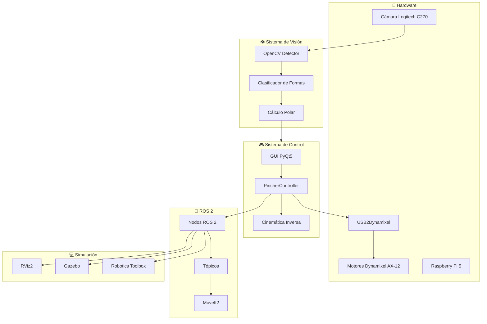

### Estructura del Repositorio

```text
Phantom_X_Pincher_ROS2_OpenCV/
├── README.md                                     # Este archivo
├── sources/                                      # 📸 Recursos multimedia
│   ├── camara.png                               # Cámara utilizada
│   ├── DH.png                                   # Diagrama Denavit-Hartenberg
│   ├── DH.mlx                                   # Análisis cinemático MATLAB
│   ├── Matlab_vis.gif                           # Animación del modelo
│   ├── rosgraph_complete.png                    # Grafo de nodos ROS 2
│   ├── plano_inicial.jpg                        # Plano posición inicial
│   ├── plano_final.jpg                          # Plano posición final
│   ├── DeteccionFiguras_1.png                   # Detección OpenCV
│   ├── DetectionCircle.png                      # Detección de círculo
│   ├── DetectionSquare.png                      # Detección de cuadrado
│   ├── DetectionRectangle.png                   # Detección de rectángulo
│   ├── DetectionPentagon.png                    # Detección de pentágono
│   └── gui/                                     # Capturas de la GUI
│       ├── gui_main.png                         # Panel principal
│       ├── gui_manual_control.png               # Control manual
│       ├── gui_fix_value.png                    # Valores fijos
│       ├── gui_pose.png                         # Ángulos predefinidos
│       ├── gui_xyz_control.png                  # Control XYZ
│       ├── gui_visualization.png                # Visualización
│       ├── gui_opencv.jpeg                      # Integración OpenCV
│       └── gui_group.png                        # Vista grupal
│
└── phantom_ws/                                   # 🤖 Workspace ROS 2
    └── src/
        ├── phantomx_pincher/                    # Meta-paquete principal
        ├── phantomx_pincher_bringup/            # 🚀 Launch files
        ├── phantomx_pincher_description/        # 🎨 URDF y meshes
        ├── phantomx_pincher_moveit_config/      # 🎯 Configuración MoveIt2
        ├── phantomx_pincher_demos/              # 📚 Ejemplos y demos
        ├── phantomx_pincher_interfaces/         # 📡 Mensajes custom
        ├── phantomx_pincher_commander_cpp/      # ⚡ Commander C++
        └── pincher_control/                     # 🎛️ Control y GUI Python
```

---

## 📦 Paquetes ROS 2

### Resumen de Paquetes

| Paquete | Propósito | Nodos Principales |
|:--------|:----------|:------------------|
| `pincher_control` | Control de motores, GUI, OpenCV | `main`, `control_servo`, `OpenCV`, `terminal_control` |
| `phantomx_pincher_description` | Modelo URDF, meshes, visualización | `robot_state_publisher` |
| `phantomx_pincher_bringup` | Launch files para simulación y hardware | — |
| `phantomx_pincher_moveit_config` | Planificación de trayectorias | `move_group` |
| `phantomx_pincher_demos` | Ejemplos de uso y demos | Varios scripts Python |
| `phantomx_pincher_interfaces` | Mensajes y servicios custom | — |

---

### 📁 pincher_control

Paquete principal que contiene el controlador de motores, la interfaz gráfica y el sistema de visión artificial.

#### Estructura del Paquete

```text
pincher_control/
├── package.xml
├── setup.py
├── setup.cfg
└── pincher_control/
    ├── __init__.py
    ├── config.py                    # Configuración de hardware
    ├── controller.py                # Controlador principal
    ├── kinematics.py                # Modelo cinemático
    ├── utils.py                     # Utilidades
    ├── styles.py                    # Estilos CSS para GUI
    ├── main.py                      # Punto de entrada GUI
    ├── control_servo.py             # GUI completa
    ├── control_servo2.py            # GUI versión 2
    ├── OpenCV.py                    # Detección de figuras
    ├── opencv_detector.py           # Detector avanzado
    ├── terminal_control.py          # Control por terminal
    ├── terminal_subscriber.py       # Suscriptor de estados
    ├── toolbox.py                   # Visualización Robotics Toolbox
    ├── LAB5_P1.py                   # Secuencia Home→Objetivo
    ├── follow_joint_trajectory_node.py  # Action server MoveIt
    └── gui/                         # Módulos de la GUI
        ├── __init__.py
        ├── main_window.py           # Ventana principal
        ├── pages/                   # Páginas de la GUI
        │   ├── dashboard.py         # Panel principal
        │   ├── manual_control.py    # Control manual
        │   ├── fixed_values.py      # Valores fijos
        │   ├── fixed_angles.py      # Ángulos predefinidos
        │   ├── xyz_control.py       # Control XYZ
        │   ├── visualization.py     # Visualización
        │   └── info.py              # Información
        └── widgets/                 # Widgets reutilizables
            └── __init__.py
```

#### Entry Points (Comandos Ejecutables)

```bash
# GUI Principal
ros2 run pincher_control main

# Control por terminal
ros2 run pincher_control terminal_control

# Suscriptor de estados
ros2 run pincher_control terminal_sub

# Visualización Robotics Toolbox
ros2 run pincher_control toolbox

# Detección OpenCV
ros2 run pincher_control OpenCV

# Secuencia de laboratorio
ros2 run pincher_control L5_P1

# Action server para MoveIt
ros2 run pincher_control follow_joint_trajectory
```

#### Archivo: `config.py`

Contiene todas las constantes de configuración del robot.

```python
# Longitudes de los eslabones (metros)
L1 = 44.0 / 1000.0    # Base a primer joint
L2 = 107.5 / 1000.0   # Hombro
L3 = 107.5 / 1000.0   # Codo
L4 = 75.3 / 1000.0    # Muñeca

# Límites de alcance
PLANAR_REACH_MAX = L2 + L3 + L4  # ~0.29 m
PLANAR_REACH_MIN = 0.04          # 4 cm
Z_MAX = L1 + L2 + L3 + L4        # ~0.334 m
Z_MIN = 0.0

# Configuración Dynamixel AX-12
PROTOCOL_VERSION = 1.0
DEFAULT_PORT = '/dev/ttyUSB0'
DEFAULT_BAUDRATE = 1000000
DEFAULT_DXL_IDS = [1, 2, 3, 4, 5]

# Nombres de articulaciones ROS 2
JOINT_NAMES = [
    'phantomx_pincher_arm_shoulder_pan_joint',
    'phantomx_pincher_arm_shoulder_lift_joint',
    'phantomx_pincher_arm_elbow_flex_joint',
    'phantomx_pincher_arm_wrist_flex_joint',
    'phantomx_pincher_gripper_finger1_joint',
]
```

#### Archivo: `controller.py`

Nodo ROS 2 principal para control de motores Dynamixel.

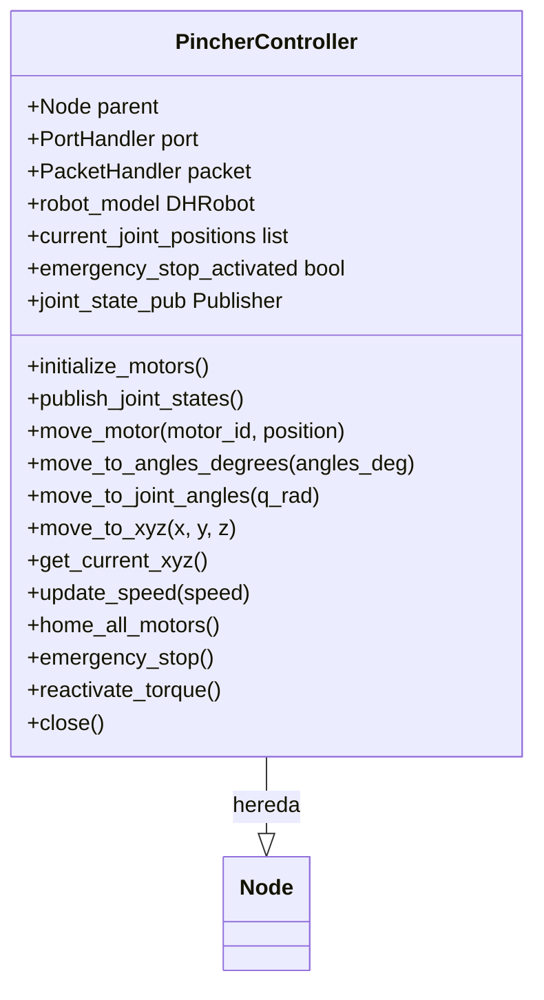

---

### 📁 phantomx_pincher_description

Contiene el modelo URDF del robot, meshes visuales y de colisión.

#### Archivos XACRO Principales

| Archivo | Propósito |
|:--------|:----------|
| `phantomx_pincher.urdf.xacro` | Modelo principal parametrizable |
| `phantomx_pincher_arm.xacro` | Definición del brazo robótico |
| `phantomx_pincher_hardware.xacro` | Interfaces de hardware |
| `phantomx_pincher_inertial.xacro` | Parámetros inerciales |
| `kit.xacro` | Kit de trabajo (canastilla, base, etc.) |
| `phantomx_pincher.gazebo` | Plugins de Gazebo |

#### Meshes Incluidos

```text
meshes/
├── visual/           # Meshes detallados para visualización
│   ├── ax12.dae      # Servo Dynamixel AX-12
│   ├── f2.dae        # Eslabón 2
│   ├── f3.dae        # Eslabón 3
│   ├── f4.dae        # Eslabón 4
│   ├── finger.dae    # Dedo del gripper
│   └── gripper_base.dae
├── collision/        # Meshes simplificados para colisiones
├── STL/              # Piezas impresas 3D
│   ├── canastilla.stl              # ✓ Canastilla de trabajo
│   ├── ensambleSoporteCamara.stl   # ✓ Mástil de cámara
│   ├── caseBaseRobot.stl
│   ├── zonaCircular146mm.stl       # Disco de referencia
│   └── ...
└── DAE/              # Meshes COLLADA con texturas
    ├── objectsToPick/
    │   ├── cube25x25.dae
    │   └── cilinder25Dx25h.dae
    └── zonasDeRecoleccion/
```

---

## 👁️ Sistema de Visión Artificial (OpenCV)

### Descripción General

El sistema de visión artificial detecta figuras geométricas de color naranja colocadas sobre un disco blanco de referencia. Utiliza múltiples características geométricas invariantes a rotación para clasificar las formas con alta precisión.

<div align="center">
  
  <p><em>Sistema de detección de figuras geométricas con OpenCV</em></p>
</div>

### Pipeline de Detección

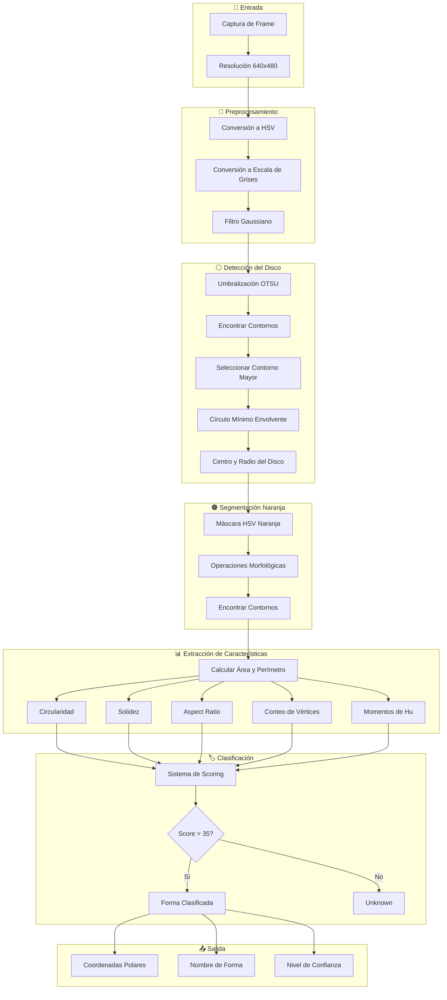

### Características Geométricas Calculadas

El sistema calcula las siguientes características para cada contorno detectado:

| Característica | Fórmula | Valor Típico |
|:---------------|:--------|:-------------|
| **Circularidad** | 4π × Área / Perímetro² | Círculo: ~1.0, Cuadrado: ~0.785 |
| **Solidez** | Área / Área del Convex Hull | >0.95 para figuras convexas |
| **Extensión** | Área / Área del Bounding Rect | Varía según orientación |
| **Aspect Ratio** | Ancho / Alto | Cuadrado: ~1.0, Rectángulo: ≠1.0 |
| **Relación de Elipse** | Eje menor / Eje mayor | Círculo: ~1.0 |
| **Número de Vértices** | Mediana de aproximaciones | 4, 5, 6+ según forma |

### Sistema de Scoring para Clasificación

```python
# Ejemplo de scoring para CÍRCULO
score_circulo = 0

# Circularidad alta = muy probablemente círculo
if circ > 0.92:
    score_circulo += 50   # Muy circular
elif circ > 0.88:
    score_circulo += 30   # Bastante circular

# Solidez alta (sin concavidades)
if solid > 0.95:
    score_circulo += 15

# Muchos vértices en aproximación poligonal
if vertices_6_plus >= 3:
    score_circulo += 15

# Penalizaciones
if vertices_4 >= 2:
    score_circulo -= 25   # Parece cuadrilátero
```

### Detección de Formas Específicas

<div align="center">
<table>
<tr>
<td align="center">
<br/>
<b>Círculo</b><br/>
Circularidad > 0.88<br/>
6+ vértices
</td>
<td align="center">
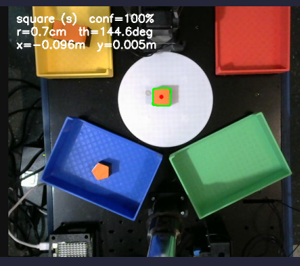<br/>
<b>Cuadrado</b><br/>
4 vértices<br/>
Aspect Ratio ≈ 1.0
</td>
</tr>
<tr>
<td align="center">
<br/>
<b>Rectángulo</b><br/>
4 vértices<br/>
Aspect Ratio ≠ 1.0
</td>
<td align="center">
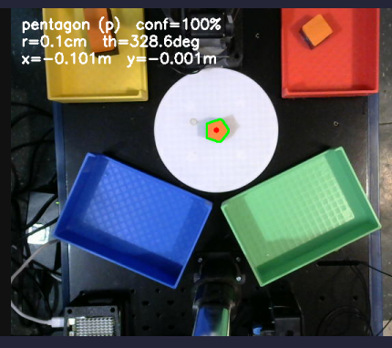<br/>
<b>Pentágono</b><br/>
5 vértices<br/>
Circularidad ≈ 0.865
</td>
</tr>
</table>
</div>

### Cálculo de Coordenadas Polares

Una vez detectada una figura, se calculan sus coordenadas polares respecto al centro del disco:

```python
# Centro del objeto usando momentos
M = cv2.moments(cnt)
cx_obj = M["m10"] / M["m00"]
cy_obj = M["m01"] / M["m00"]

# Vector del centro del disco al objeto
dx = cx_obj - cx_disk
dy = cy_obj - cy_disk

# Distancia radial (teorema de Pitágoras)
r_pix = math.hypot(dx, dy)  # sqrt(dx² + dy²)
r_cm = r_pix * scale        # Convertir a cm

# Ángulo theta (Y invertido en imagen)
theta_rad = math.atan2(-dy, dx)
theta_deg = (math.degrees(theta_rad) + 360.0) % 360.0
```

### Funciones Utilitarias

#### Conversión Polar a Cartesiano

```python
def polar_to_cartesian_m(r_cm, theta_deg, offset_x_m=0.0, offset_y_m=0.0):
    """
    Convierte coordenadas polares a cartesianas (metros).
    
    Args:
        r_cm: Distancia radial en centímetros
        theta_deg: Ángulo en grados (0° = +X, 90° = +Y)
        offset_x_m, offset_y_m: Offsets de posición
    
    Returns:
        tuple: (x_m, y_m) en metros
    """
    r_m = r_cm / 100.0
    th = math.radians(theta_deg)
    x = r_m * math.cos(th) + offset_x_m
    y = r_m * math.sin(th) + offset_y_m
    return x, y
```

#### Codificación de Formas

```python
def shape_name_to_code(shape_name):
    """
    Convierte nombre de forma a código de una letra.
    
    Mapping:
        "square"    -> "s"
        "rectangle" -> "r"
        "circle"    -> "c"
        "pentagon"  -> "p"
        otros       -> "u" (unknown)
    """
    mapping = {
        "square": "s",
        "rectangle": "r",
        "circle": "c",
        "pentagon": "p",
    }
    return mapping.get(shape_name, "u")
```

### Diagrama de Flujo Completo de OpenCV.py

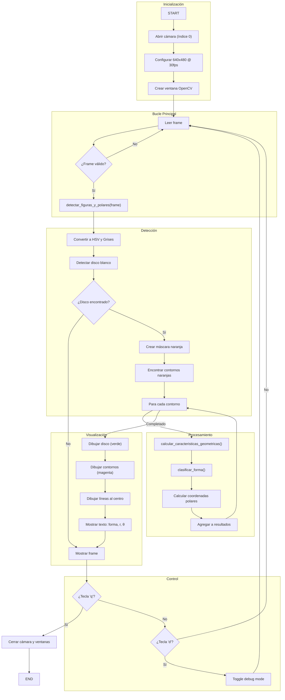

---

## 🖥️ Interfaz Gráfica de Usuario (GUI)

### Descripción General

La interfaz gráfica desarrollada en **PyQt5** proporciona control completo del robot PhantomX Pincher con un diseño moderno oscuro y 7 páginas especializadas.

### Arquitectura de la GUI

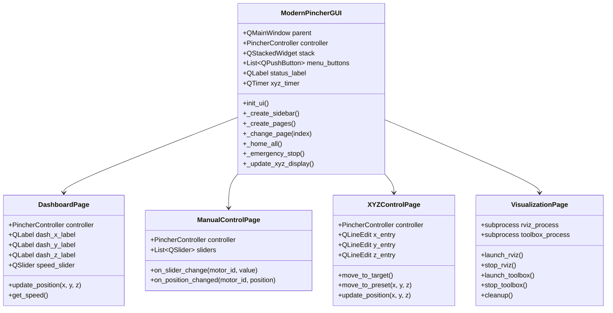

### Páginas de la GUI

#### 1. Panel Principal (Dashboard)

<div align="center">
  
  <p><em>Vista general del estado del robot y control de velocidad global</em></p>
</div>

**Funcionalidades:**
- Posición cartesiana actual (X, Y, Z) en tiempo real
- Estado de los 5 motores
- Control de velocidad global (slider 0-1023)
- Botón HOME rápido
- Parada de emergencia

#### 2. Control Manual

<div align="center">
  
  <p><em>Sliders independientes para cada articulación</em></p>
</div>

**Funcionalidades:**
- 5 sliders (uno por motor)
- Valores en tiempo real (0-1023 o 0-4095)
- Actualización inmediata de posiciones
- Feedback visual del estado

#### 3. Valores Fijos

<div align="center">
  
  <p><em>Entrada numérica directa para control preciso</em></p>
</div>

**Funcionalidades:**
- Entrada numérica para cada motor
- Botones "Mover" individuales
- Botón "Mover Todos" para comando conjunto
- Validación de límites

#### 4. Ángulos Predefinidos

<div align="center">
  
  <p><em>5 configuraciones preestablecidas con un solo clic</em></p>
</div>

**Configuraciones Disponibles:**

| Configuración | Waist | Shoulder | Elbow | Wrist | Gripper | Descripción |
|:--------------|:-----:|:--------:|:-----:|:-----:|:-------:|:------------|
| Posición 1 | 0° | 0° | 0° | 0° | 0° | HOME |
| Posición 2 | 25° | 25° | 20° | -20° | 0° | Alcance Medio |
| Posición 3 | -35° | 35° | -30° | 30° | 0° | Lateral |
| Posición 4 | 85° | -20° | 55° | 25° | 0° | Elevada |
| Posición 5 | 80° | -35° | 55° | -45° | 0° | Extendida |

#### 5. Control XYZ

<div align="center">
  
  <p><em>Movimiento en coordenadas cartesianas con cinemática inversa</em></p>
</div>

**Funcionalidades:**
- Entrada de coordenadas X, Y, Z en metros
- Cinemática inversa con Levenberg-Marquardt
- Validación de alcance en tiempo real
- 4 posiciones rápidas predefinidas
- Feedback del estado de IK

#### 6. Visualización

<div align="center">
  
  <p><em>Lanzadores para RViz2 y Robotics Toolbox</em></p>
</div>

**Funcionalidades:**
- Lanzar RViz2 desde la GUI
- Lanzar visualización Robotics Toolbox
- Indicadores de estado de procesos
- Control de inicio/parada

#### Vista Completa de la GUI

<div align="center">
  
  <p><em>Vista completa de la interfaz moderna con menú lateral</em></p>
</div>

### Tema Visual

La GUI utiliza un diseño **oscuro profesional** con los siguientes elementos:

```css
/* Colores principales */
--background: #1e1e2e;
--sidebar: linear-gradient(#0f0f1e, #1a1a2e);
--accent: #00d9ff;
--card: #252538;
--text: #e0e0e0;
--danger: linear-gradient(#ff416c, #ff4b2b);
--success: linear-gradient(#6a11cb, #2575fc);
```

### Diagrama de Flujo de la GUI

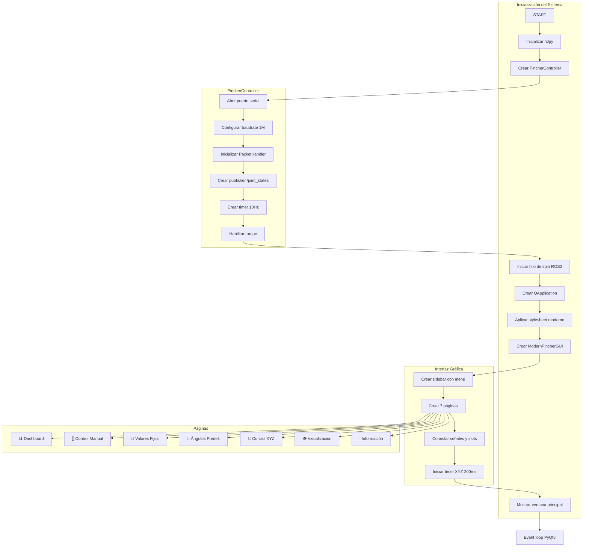

---

## 📐 Cinemática del Robot

### Parámetros Denavit-Hartenberg

<div align="center">
  
  <p><em>Asignación de sistemas coordenados según la convención Denavit-Hartenberg</em></p>
</div>

| Articulación | θ (rad) | d (m) | a (m) | α (rad) |
|:------------:|:-------:|:-----:|:-----:|:-------:|
| 1 | q₁ | 0.044 | 0 | π/2 |
| 2 | q₂ + π/2 | 0 | 0.1075 | 0 |
| 3 | q₃ | 0 | 0.1075 | 0 |
| 4 | q₄ | 0 | 0.0753 | 0 |

### Implementación con Robotics Toolbox

```python
def build_pincher_robot():
    """Construye el modelo DH del robot PhantomX Pincher."""
    L1, L2, L3, L4 = 0.044, 0.1075, 0.1075, 0.0753  # metros
    
    links = [
        rtb.RevoluteDH(d=L1, a=0.0, alpha=np.pi/2, offset=0.0),
        rtb.RevoluteDH(d=0.0, a=L2, alpha=0.0, offset=np.pi/2),
        rtb.RevoluteDH(d=0.0, a=L3, alpha=0.0, offset=0.0),
        rtb.RevoluteDH(d=0.0, a=L4, alpha=0.0, offset=0.0),
    ]
    
    robot = rtb.DHRobot(links, name="Pincher")
    T_tool = SE3.Rz(-np.pi/2) * SE3.Rx(-np.pi/2)
    robot.tool = T_tool
    
    return robot
```

### Cinemática Inversa (Levenberg-Marquardt)

```python
def inverse_kinematics(robot, x, y, z, q_current, orientation='down'):
    """
    Calcula cinemática inversa usando ikine_LM.
    
    Args:
        robot: Modelo del robot
        x, y, z: Posición objetivo
        q_current: Configuración actual (semilla)
        orientation: 'down' para gripper hacia abajo
    
    Returns:
        (success, q_solution)
    """
    # Transformación objetivo
    if orientation == 'down':
        T_target = SE3(x, y, z) * SE3.Rx(np.pi)
    else:
        T_target = SE3(x, y, z)
    
    # Múltiples semillas para robustez
    seeds = [
        np.array(q_current),
        np.array([0, 0, 0, 0]),
        np.array([0, 0.5, -0.5, 0]),
        np.array([0, 1.0, -1.0, 0]),
    ]
    
    best_sol, best_error = None, float('inf')
    
    for seed in seeds:
        sol = robot.ikine_LM(
            T_target, q0=seed, ilimit=1000, slimit=100,
            mask=[1, 1, 1, 0, 0, 0]  # Solo posición, no orientación
        )
        
        if sol.success:
            T_check = robot.fkine(sol.q)
            error = np.linalg.norm(T_check.t - T_target.t)
            
            if error < best_error:
                best_error = error
                best_sol = sol
            
            if error < 0.003:  # 3mm de precisión
                break
    
    return (best_sol is not None, best_sol.q if best_sol else None)
```

### Visualización MATLAB

<div align="center">
  
  <p><em>Animación del modelo cinemático en MATLAB usando el Robotics Toolbox de Peter Corke</em></p>
</div>

---

## 🔗 Nodos y Comunicación ROS 2

### Grafo de Nodos

<div align="center">
  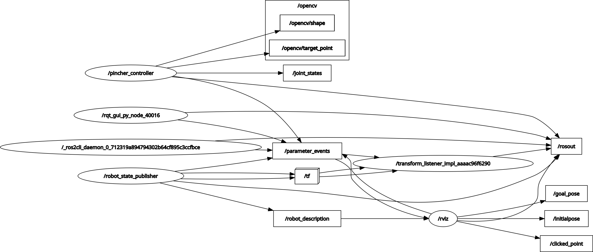
  <p><em>Diagrama de nodos y tópicos del sistema completo</em></p>
</div>

### Descripción de Nodos

| Nodo | Paquete | Función |
|:-----|:--------|:--------|
| `/pincher_controller` | `pincher_control` | Control de motores Dynamixel, publica `/joint_states` |
| `/robot_state_publisher` | `robot_state_publisher` | Cinemática directa, publica transformaciones `/tf` |
| `/transform_listener` | (interno) | Escucha transformaciones para consultar poses |
| `/move_group` | `moveit_ros_move_group` | Planificación de trayectorias |
| `/pincher_visualizer` | `pincher_control` | Visualización con Robotics Toolbox |

### Tópicos Principales

| Tópico | Tipo | Publicador | Suscriptores | Descripción |
|:-------|:-----|:-----------|:-------------|:------------|
| `/joint_states` | `sensor_msgs/JointState` | `pincher_controller` | `robot_state_publisher`, `toolbox` | Estados articulares |
| `/robot_description` | `std_msgs/String` | `robot_state_publisher` | RViz, MoveIt | Modelo URDF |
| `/tf` | `tf2_msgs/TFMessage` | `robot_state_publisher` | RViz, MoveIt | Transformaciones |

### Mensaje JointState

```python
# Estructura del mensaje sensor_msgs/JointState
header:
  stamp:
    sec: 1234567890
    nanosec: 123456789
  frame_id: "base_link"
name:
  - "phantomx_pincher_arm_shoulder_pan_joint"
  - "phantomx_pincher_arm_shoulder_lift_joint"
  - "phantomx_pincher_arm_elbow_flex_joint"
  - "phantomx_pincher_arm_wrist_flex_joint"
  - "phantomx_pincher_gripper_finger1_joint"
position: [0.0, 0.0, 0.0, 0.0, 0.0]
velocity: []
effort: []
```

### Diagrama de Comunicación

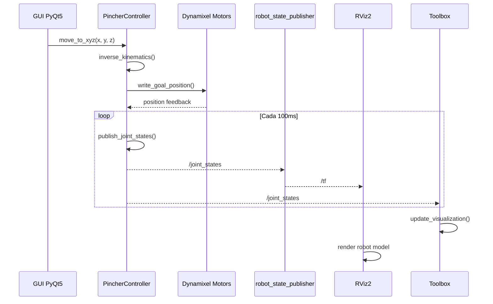

---

## 🎯 Rutina de Pick & Place

### Descripción de la Rutina

El sistema ejecuta una rutina automatizada que:
1. Detecta figuras geométricas usando OpenCV
2. Calcula coordenadas polares de cada figura
3. Convierte a coordenadas cartesianas del robot
4. Ejecuta secuencia de Pick para recoger la pieza
5. Clasifica por forma y deposita en contenedor correspondiente

### Mapeo Forma → Color de Contenedor

| Forma | Código | Color Contenedor |
|:------|:------:|:----------------:|
| Cuadrado | `s` | 🔴 Rojo |
| Círculo | `c` | 🟢 Verde |
| Pentágono | `p` | 🔵 Azul |
| Rectángulo | `r` | 🟡 Amarillo |

### Diagrama de Flujo de Pick & Place

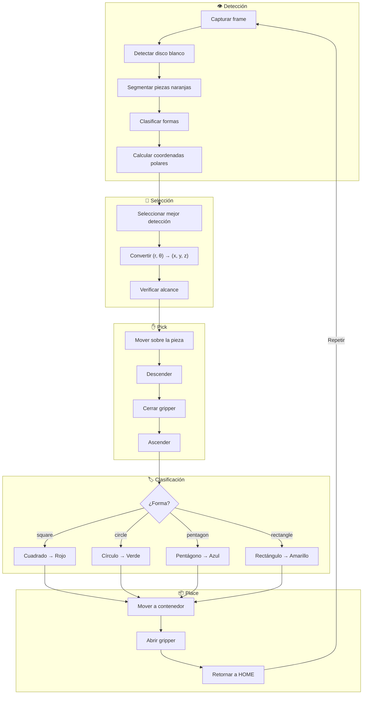

---

## 📐 Plano de Planta

### Posición Inicial

<div align="center">
  
  <p><em>Disposición inicial con la pieza en el centro del disco blanco</em></p>
</div>

La figura a manipular se coloca siempre en el centro del disco blanco de referencia (diámetro 146mm). El sistema de visión detecta la posición exacta y calcula las coordenadas polares.

### Posición Final

<div align="center">
  
  <p><em>Disposición de contenedores codificados por color</em></p>
</div>

Los contenedores están dispuestos alrededor del espacio de trabajo del robot, cada uno identificado por un color correspondiente a una forma geométrica específica.

---

## 📷 Configuración de Cámara

### Hardware Utilizado

<div align="center">
  
  <p><em>Cámara web Logitech HD C270</em></p>
</div>

| Especificación | Valor |
|:---------------|:------|
| Modelo | Logitech HD C270 |
| Resolución | 720p (1280x720) |
| Resolución de trabajo | 640x480 |
| FPS | 30 |
| Campo Visual | 55° |
| Micrófono | Integrado (alcance 1.5m) |
| Conexión | USB-A |
| Compatibilidad | Windows 8+, macOS 10.10+, ChromeOS |

### Configuración en Código

```python
# Inicialización de la cámara
cap = cv2.VideoCapture(0)

# Configuración de parámetros
cap.set(cv2.CAP_PROP_FOURCC, cv2.VideoWriter_fourcc(*"MJPG"))
cap.set(cv2.CAP_PROP_FRAME_WIDTH, 640)
cap.set(cv2.CAP_PROP_FRAME_HEIGHT, 480)
cap.set(cv2.CAP_PROP_FPS, 30)
```

### Calibración del Sistema

```python
# Radio físico del disco blanco (cm)
DISK_RADIUS_CM = 7.25

# Factor de escala: convierte píxeles a centímetros
scale = DISK_RADIUS_CM / R_pix  # cm/pixel
```

### Rangos de Color HSV

```python
# Rango para detección de objetos naranjas
lower_orange = np.array([3, 70, 70], dtype=np.uint8)
upper_orange = np.array([28, 255, 255], dtype=np.uint8)
```

---

## 🚀 Ejecución del Sistema

### Modo Simulación

```bash
# Terminal 1: Lanzar stack completo en simulación
ros2 launch phantomx_pincher_bringup phantomx_pincher.launch.py use_real_robot:=false

# Terminal 2: GUI de control
ros2 run pincher_control main

# Terminal 3 (opcional): Detección OpenCV
ros2 run pincher_control OpenCV
```

### Modo Hardware Real

```bash
# Terminal 1: Lanzar con hardware real
ros2 launch phantomx_pincher_bringup phantomx_pincher.launch.py use_real_robot:=true

# Terminal 2: GUI de control
ros2 run pincher_control main

# Terminal 3: Detección OpenCV
ros2 run pincher_control OpenCV
```

### Solo Visualización RViz

```bash
ros2 launch phantomx_pincher_description display.launch.py
```

### Control por Terminal

```bash
# Controlador interactivo
ros2 run pincher_control terminal_control

# Comandos disponibles:
# <motor_id> <ángulo>  → Ejemplo: 2 45
# c1, c2, c3, c4, c5   → Configuraciones predefinidas
# help                 → Mostrar ayuda
# q                    → Salir
```

### Visualización Robotics Toolbox

```bash
ros2 run pincher_control toolbox
```

---

## 🎓 Conclusiones

1. **Integración de Visión y Control:** La combinación de OpenCV para detección de formas con el controlador ROS 2 demostró ser efectiva para tareas de Pick & Place automatizadas. El sistema de scoring basado en características geométricas invariantes logró clasificaciones precisas incluso con variaciones de iluminación y orientación.

2. **Sistema de Coordenadas Polares:** La transformación de coordenadas de imagen a coordenadas polares y posteriormente a cartesianas del robot permitió una integración natural entre el sistema de visión y el controlador de movimiento.

3. **Arquitectura Modular ROS 2:** La separación en paquetes independientes (descripción, control, visión, demos) facilitó el desarrollo paralelo y el mantenimiento del código. El uso de nodos ROS 2 con comunicación por tópicos permitió desacoplar los subsistemas.

4. **GUI Profesional:** El desarrollo de una interfaz gráfica completa en PyQt5 abstrajo la complejidad del sistema, permitiendo la operación por usuarios sin conocimiento técnico profundo de ROS 2.

5. **Cinemática Inversa Robusta:** El algoritmo Levenberg-Marquardt con múltiples semillas demostró convergencia confiable para la mayoría de posiciones dentro del espacio de trabajo alcanzable.

6. **Modelo URDF Extendido:** La inclusión de la canastilla, soporte de cámara y elementos del entorno en el modelo XACRO permitió simulaciones más realistas y planificación de trayectorias con detección de colisiones.

7. **Flexibilidad Simulación/Hardware:** La arquitectura con launch files parametrizables permite alternar fácilmente entre simulación y hardware real, facilitando el desarrollo y depuración.

8. **Detección de Formas:** El sistema de scoring multicriterio para clasificación de formas demostró ser más robusto que métodos simples basados solo en conteo de vértices, especialmente para distinguir entre formas con características similares (ej. cuadrado vs rectángulo).

---

## 📚 Referencias

1. **Laboratorio de Robótica - Universidad Nacional de Colombia.** Guías de laboratorio del curso de Robótica, 2025.

2. ROBOTIS. *DYNAMIXEL SDK Manual.* Documentación oficial para comunicación con servomotores Dynamixel.  
   https://emanual.robotis.com/docs/en/software/dynamixel/dynamixel_sdk/

3. Open Robotics. *ROS 2 Jazzy Documentation.*  
   https://docs.ros.org/en/jazzy/

4. MoveIt. *MoveIt 2 Documentation.*  
   https://moveit.ros.org/

5. Corke, P. *Robotics Toolbox for Python.* GitHub Repository.  
   https://github.com/petercorke/robotics-toolbox-python

6. OpenCV. *OpenCV-Python Tutorials.*  
   https://docs.opencv.org/master/d6/d00/tutorial_py_root.html

7. Qt Company. *PyQt5 Documentation.*  
   https://www.riverbankcomputing.com/static/Docs/PyQt5/

8. Craig, J.J. *Introduction to Robotics: Mechanics and Control.* Pearson, 3rd Edition, 2005.

9. Trossen Robotics. *PhantomX Pincher Robot Arm Assembly Guide.*

10. Corke, P. *Robotics, Vision and Control: Fundamental Algorithms in MATLAB.* Springer, 2017.

---

## 🛠️ Tecnologías Utilizadas

<div align="center">


</div>

---

## 📄 Licencia

Este proyecto está bajo la Licencia MIT. Ver el archivo `LICENSE` para más detalles.

---

## 🤝 Contribuciones

Las contribuciones son bienvenidas. Por favor:

1. Fork el proyecto
2. Crea una rama para tu feature (`git checkout -b feature/AmazingFeature`)
3. Commit tus cambios (`git commit -m 'Add: AmazingFeature'`)
4. Push a la rama (`git push origin feature/AmazingFeature`)
5. Abre un Pull Request

---

## 📧 Contacto

**Samuel David Sánchez Cárdenas** (Autor Principal)  
📧 Email: samsanchezca@unal.edu.co  
🔗 GitHub: [@samsanchezcar](https://github.com/samsanchezcar)

**Equipo de Desarrollo:**
- Juan Ángel Vargas Rodríguez - juvargasro@unal.edu.co
- Santiago Mariño Cortés - smarinoc@unal.edu.co
- Juan José Delgado Estrada - judelgadoe@unal.edu.co
- Santiago Ávila Corredor - savilaco@unal.edu.co

---

<div align="center">
  
</div>
