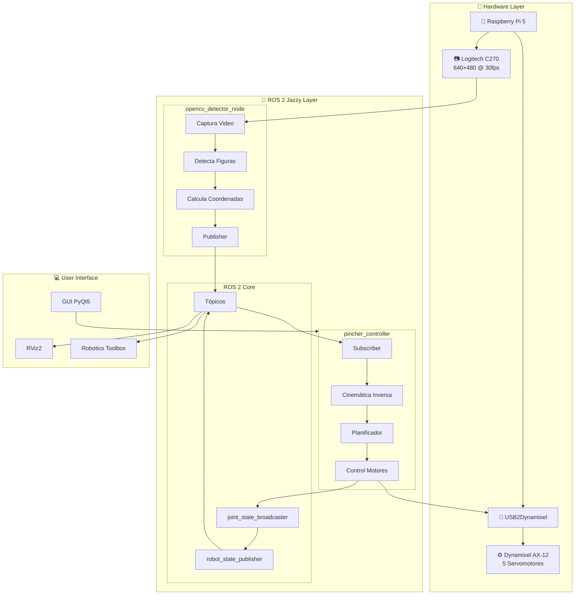
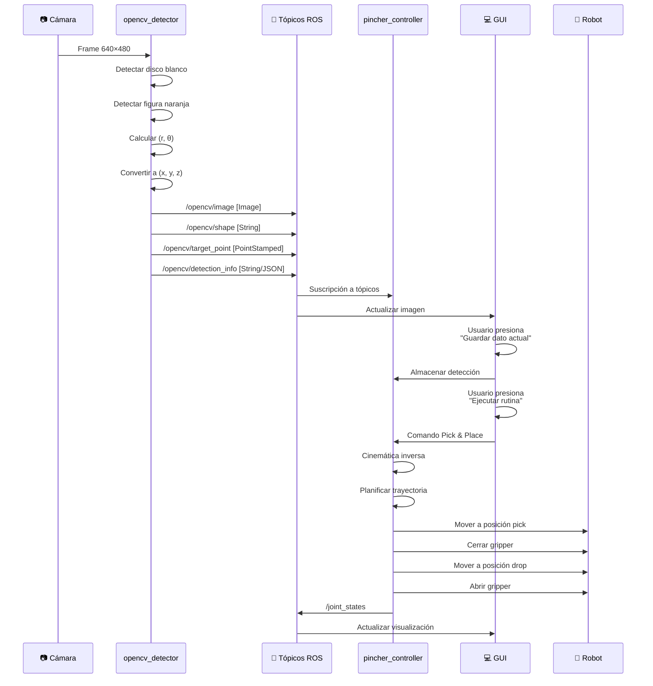
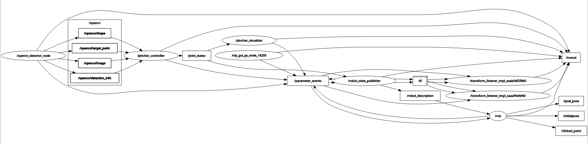
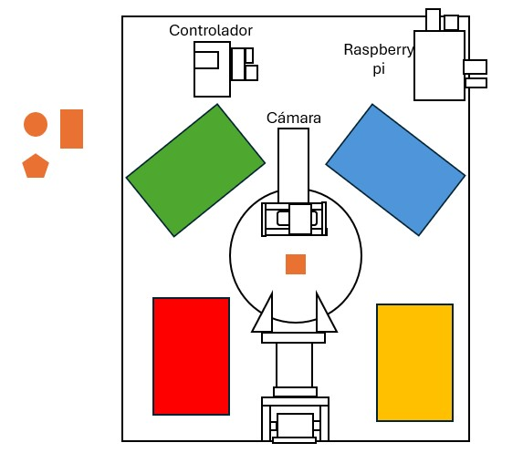
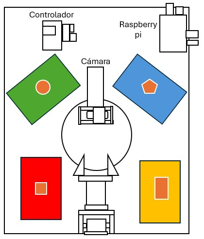

<div align="center">
  
</div>

---

# 🤖 PhantomX Pincher X100 — ROS 2 Jazzy · OpenCV · Pick & Place

<div align="center">


**Sistema completo de manipulación robótica con detección de figuras geométricas y arquitectura distribuida ROS 2**

[📹 Ver Demo](#-videos-demostrativos) • [🚀 Instalación](#-instalación-y-configuración) • [📖 Documentación](#-tabla-de-contenidos) • [👥 Equipo](#-autores)

</div>

---

## 📖 Resumen Ejecutivo

Sistema robótico avanzado de **Pick & Place** con visión artificial para el robot **PhantomX Pincher X100**. Implementa una arquitectura distribuida de nodos ROS 2 donde:

- **`opencv_detector`** (Publisher Node) — Captura video, detecta figuras geométricas y publica coordenadas 3D
- **`pincher_controller`** (Subscriber Node) — Controla el robot, ejecuta pick & place y proporciona interfaz gráfica

El sistema detecta y clasifica automáticamente figuras geométricas (círculo, cuadrado, rectángulo, pentágono) de color naranja sobre un disco blanco de referencia, calcula sus coordenadas polares y cartesianas, y ejecuta rutinas autónomas de recolección y clasificación.

### Características Principales

- ✅ **Arquitectura Distribuida ROS 2** — Nodos independientes con comunicación por tópicos
- ✅ **Detección Automática** — 4 tipos de figuras geométricas con scoring multicriterio
- ✅ **Coordenadas Polares** — Cálculo en tiempo real respecto al disco de referencia
- ✅ **Cinemática Inversa** — Algoritmo Levenberg-Marquardt con múltiples semillas
- ✅ **GUI Profesional** — Interfaz moderna con PyQt5 y 8 pestañas de control
- ✅ **Visualización Avanzada** — Integración con RViz2 y Robotics Toolbox
- ✅ **Hardware & Software** — Compatible con robot real y visualización simulada

---

## 🎥 Videos Demostrativos

<div align="center">

| Video | Descripción | Enlace |
|:-----:|:------------|:------:|
| 🎬 **Demo Final** | Sistema completo con OpenCV y Pick & Place | [](https://youtu.be/jv4XF2xeA04) |
| 🔧 **Demo Preliminar** | Funcionamiento básico sin visión artificial | [](https://youtu.be/obf1X0HfMZE) |

</div>

---

## 🧾 Autores

<div align="center">

| Autor | Correo | GitHub |
|:------|:-------|:-------|
| **Samuel David Sanchez Cardenas** | samsanchezca@unal.edu.co | [](https://github.com/samsanchezcar) |
| **Santiago Ávila Corredor** | savilaco@unal.edu.co | [](https://github.com/Santiago-Avila) |
| **Santiago Mariño Cortés** | smarinoc@unal.edu.co | [](https://github.com/mrbrightside8) |
| **Juan Ángel Vargas Rodríguez** | juvargasro@unal.edu.co | [](https://github.com/juvargasro) |
| **Juan José Delgado Estrada** | judelgadoe@unal.edu.co | [](https://github.com/Juan-delgado1) |

**Universidad Nacional de Colombia • Facultad de Ingeniería Mecatrónica**  
**Robótica • Semestre 2025-1**

</div>

---

## 📋 Tabla de Contenidos

1. [Introducción](#-introducción)
2. [Objetivos](#-objetivos)
3. [Arquitectura del Sistema](#-arquitectura-del-sistema)
   - [Diagrama de Nodos ROS 2](#diagrama-de-nodos-ros-2)
   - [Flujo de Datos](#flujo-de-datos)
4. [Instalación y Configuración](#-instalación-y-configuración)
5. [Estructura de Paquetes](#-estructura-de-paquetes)
6. [Sistema de Visión OpenCV](#-sistema-de-visión-opencv)
   - [Nodo opencv_detector](#nodo-opencv_detector)
   - [Pipeline de Detección](#pipeline-de-detección)
   - [Cálculo de Coordenadas](#cálculo-de-coordenadas)
7. [Controlador Principal](#-controlador-principal)
   - [Nodo pincher_controller](#nodo-pincher_controller)
   - [Cinemática Inversa](#cinemática-inversa)
   - [Rutina Pick & Place](#rutina-pick--place)
8. [Interfaz Gráfica (GUI)](#-interfaz-gráfica-gui)
9. [Nodos y Tópicos ROS 2](#-nodos-y-tópicos-ros-2)
10. [Configuración de Cámara](#-configuración-de-cámara)
11. [Calibración del Sistema](#-calibración-del-sistema)
12. [Ejecución del Sistema](#-ejecución-del-sistema)
13. [Troubleshooting](#-troubleshooting)
14. [Cinemática del Robot](#-cinemática-del-robot)
15. [Plano de Planta](#-plano-de-planta)
16. [Conclusiones](#-conclusiones)
17. [Referencias](#-referencias)

---

## 📖 Introducción

Este proyecto representa la culminación del curso de Robótica, integrando múltiples disciplinas: cinemática de manipuladores, visión por computadora, control de actuadores y desarrollo de software robótico. El sistema permite al robot **PhantomX Pincher X100** identificar, localizar y manipular objetos geométricos de manera autónoma.

---

## 🎯 Objetivos

### Objetivo General

Desarrollar un sistema robótico completo de **Pick & Place** con visión artificial que permita al robot PhantomX Pincher X100 detectar, clasificar y manipular figuras geométricas de manera autónoma utilizando una arquitectura distribuida de nodos ROS 2.

### Objetivos Específicos

1. **Implementar arquitectura distribuida ROS 2** con nodos independientes para visión y control
2. **Desarrollar sistema de detección** con OpenCV capaz de identificar círculos, cuadrados, rectángulos y pentágonos
3. **Calcular coordenadas polares** de objetos respecto a disco de referencia
4. **Implementar cinemática inversa robusta** con algoritmo Levenberg-Marquardt
5. **Crear interfaz gráfica profesional** con PyQt5 para operación intuitiva
6. **Desarrollar rutinas automatizadas** de Pick & Place con clasificación por forma
7. **Integrar con MoveIt2** para planificación de trayectorias
8. **Documentar completamente** el sistema para replicabilidad

---

## 🏗️ Arquitectura del Sistema

### Diagrama General de Componentes



### Diagrama de Nodos ROS 2

Basado en el grafo real del sistema (`rqt_graph`):

```
┌─────────────────────────┐
│   opencv_detector_node  │
│      (Publisher)        │
│                         │
│  📷 Captura video       │
│  🔍 Detecta figuras     │
│  📊 Calcula coords      │
└───────────┬─────────────┘
            │
            │ Publica a:
            │ • /opencv/image
            │ • /opencv/shape
            │ • /opencv/target_point
            │ • /opencv/target_joint
            │ • /opencv/detection_info
            │
            ▼
     ┌──────────────┐
     │   Tópicos    │
     │   ROS 2      │
     └──────┬───────┘
            │
            │ Suscripciones
            │
            ▼
┌─────────────────────────┐
│   pincher_controller    │
│     (Subscriber)        │
│                         │
│  🤖 Control motores     │
│  📐 Cinemática inversa  │
│  🎯 Pick & Place        │
│  💻 GUI PyQt5           │
└───────────┬─────────────┘
            │
            │ Publica a:
            │ • /joint_states
            │ • /parameter_events
            │
            ▼
     ┌──────────────────┐
     │ robot_state_     │
     │ publisher        │
     └──────┬───────────┘
            │
            ▼
     ┌──────────────────┐
     │   RViz2          │
     │   Visualización  │
     └──────────────────┘
```

### Flujo de Datos Detallado


<div align="center">
  
  <p><em>Diagrama Denavit-Hartenberg del PhantomX Pincher X100</em></p>
</div>
---

## 📥 Instalación y Configuración

### Requisitos del Sistema

| Componente | Versión/Especificación |
|:-----------|:-----------------------|
| Sistema Operativo | Ubuntu 24.04 LTS |
| ROS 2 | Jazzy Jalisco |
| Python | 3.12+ |
| OpenCV | 4.x |
| PyQt5 | 5.15+ |
| MoveIt2 | Jazzy |

### Paso 1: Instalar Dependencias ROS 2

```bash
# Actualizar sistema
sudo apt update && sudo apt upgrade -y

# ROS 2 Desktop Full
sudo apt install -y ros-jazzy-desktop-full

# Paquetes de control y planificación
sudo apt install -y \
    ros-jazzy-moveit \
    ros-jazzy-ros2-control \
    ros-jazzy-ros2-controllers \
    ros-jazzy-controller-manager \
    ros-jazzy-joint-state-broadcaster \
    ros-jazzy-joint-trajectory-controller

# Dynamixel SDK
sudo apt install -y ros-jazzy-dynamixel-sdk

# cv_bridge para conversión de imágenes
sudo apt install -y ros-jazzy-cv-bridge

# Herramientas de visualización
sudo apt install -y \
    ros-jazzy-rqt \
    ros-jazzy-rqt-image-view \
    ros-jazzy-rviz2
```

### Paso 2: Instalar Dependencias Python

```bash
# OpenCV y procesamiento de imágenes
pip3 install opencv-python numpy

# Interfaz gráfica
pip3 install PyQt5 PyQt5-sip

# Cinemática y robótica
pip3 install roboticstoolbox-python spatialmath-python

# Dynamixel SDK Python
pip3 install dynamixel-sdk

# Utilidades adicionales
pip3 install scipy matplotlib
```

### Paso 3: Clonar y Compilar el Workspace

```bash
# Crear workspace
mkdir -p ~/ros2_ws/phantom_ws/src
cd ~/ros2_ws/phantom_ws/src

# Clonar repositorio
git clone https://github.com/samsanchezcar/Phantom_X_Pincher_ROS2_OpenCV.git .

# Volver al directorio del workspace
cd ~/ros2_ws/phantom_ws

# Compilar con colcon
colcon build

# Source el workspace
source install/setup.bash
```

---

## 📁 Estructura de Paquetes

```
Phantom_X_Pincher_ROS2_OpenCV/
├── README.md                              # Este archivo
├── README_ROS2_OPENCV.md                  # Documentación técnica de arquitectura
├── RESUMEN_ENTREGA.md                     # Resumen de cambios
├── sources/                               # 📸 Recursos multimedia
│   ├── camara.png                        # Cámara utilizada
│   ├── DH.png                            # Diagrama Denavit-Hartenberg
│   ├── plano_inicial.jpg                 # Setup inicial
│   ├── plano_final.jpg                   # Disposición de contenedores
│   └── gui/                              # Capturas de interfaz
│
├── phantomx_pincher_description/          # 📐 Descripción URDF/XACRO
│   ├── urdf/
│   │   ├── phantomx_pincher.urdf.xacro  # Modelo principal
│   │   ├── _canastilla.urdf.xacro       # Canastilla de trabajo
│   │   ├── _mastil.urdf.xacro           # Soporte de cámara
│   │   └── _camara.urdf.xacro           # Cámara Logitech C270
│   ├── meshes/                           # Modelos 3D STL
│   ├── config/
│   │   └── pincher_rviz.rviz            # Configuración RViz
│   ├── launch/
│   │   └── display.launch.py            # Launch para visualización
│   ├── package.xml
│   └── CMakeLists.txt
│
├── phantomx_pincher_moveit_config/        # 🎯 Configuración MoveIt2
│   ├── config/
│   │   ├── pincher.srdf                  # Definición semántica
│   │   ├── joint_limits.yaml            # Límites de joints
│   │   ├── kinematics.yaml              # Solver de cinemática
│   │   └── ompl_planning.yaml           # Planificación OMPL
│   ├── launch/
│   │   ├── moveit.launch.py
│   │   └── demo.launch.py
│   ├── package.xml
│   └── CMakeLists.txt
│
├── pincher_control/                       # 🎮 Control y GUI
│   ├── pincher_control/
│   │   ├── __init__.py
│   │   ├── control_servo2.py            # ⭐ Controlador principal
│   │   ├── opencv_detector.py           # ⭐ Detector OpenCV
│   │   ├── terminal_control.py          # Control por CLI
│   │   └── toolbox_viz.py               # Visualización RTB
│   ├── launch/
│   │   └── pincher_opencv.launch.py     # Launch unificado
│   ├── resource/
│   ├── test/
│   ├── setup.py
│   ├── setup.cfg
│   └── package.xml
│
├── phantomx_pincher_bringup/              # 🚀 Launch principal
│   ├── launch/
│   │   └── phantomx_pincher.launch.py   # Launch stack completo
│   ├── config/
│   │   └── pincher_controllers.yaml     # Configuración controladores
│   ├── package.xml
│   └── CMakeLists.txt
│
└── demos/                                 # 🎪 Aplicaciones de demostración
    ├── demo_joystick.py
    ├── demo_trajectory.py
    └── demo_pick_place.py
```

### Archivos Clave del Proyecto

| Archivo | Descripción | Tipo |
|:--------|:------------|:-----|
| `control_servo2.py` | Nodo subscriber, controlador principal con GUI | Python Node |
| `opencv_detector.py` | Nodo publisher, detección de figuras | Python Node |
| `pincher_opencv.launch.py` | Launch file para ambos nodos | Launch File |
| `phantomx_pincher.urdf.xacro` | Descripción URDF del robot | XACRO |
| `README_ROS2_OPENCV.md` | Documentación técnica detallada | Markdown |

---

## 👁️ Sistema de Visión OpenCV

### Nodo opencv_detector

**Tipo:** Publisher Node  
**Ejecutable:** `ros2 run pincher_control opencv_detector`  
**Función:** Captura video, detecta figuras geométricas y publica información a tópicos ROS 2

#### Inicialización del Nodo

```python
class OpenCVDetectorNode(Node):
    """
    Nodo ROS 2 para detección de figuras geométricas con OpenCV.
    Captura video de la cámara, detecta objetos naranjas sobre disco blanco,
    calcula coordenadas polares y publica a múltiples tópicos.
    """
    
    def __init__(self):
        super().__init__('opencv_detector_node')
        
        # Declarar parámetros configurables
        self.declare_parameter('camera_index', 0)
        self.declare_parameter('publish_rate', 10.0)
        
        # Obtener valores de parámetros
        camera_idx = self.get_parameter('camera_index').value
        rate_hz = self.get_parameter('publish_rate').value
        
        # Inicializar cámara
        self.cap = cv2.VideoCapture(camera_idx)
        self.cap.set(cv2.CAP_PROP_FOURCC, cv2.VideoWriter_fourcc(*"MJPG"))
        self.cap.set(cv2.CAP_PROP_FRAME_WIDTH, 640)
        self.cap.set(cv2.CAP_PROP_FRAME_HEIGHT, 480)
        self.cap.set(cv2.CAP_PROP_FPS, 30)
        
        # cv_bridge para conversión de imágenes
        self.bridge = CvBridge()
        
        # Publishers
        self.image_pub = self.create_publisher(
            Image, '/opencv/image', 10
        )
        self.shape_pub = self.create_publisher(
            String, '/opencv/shape', 10
        )
        self.target_point_pub = self.create_publisher(
            PointStamped, '/opencv/target_point', 10
        )
        self.detection_info_pub = self.create_publisher(
            String, '/opencv/detection_info', 10
        )
        
        # Timer para captura y procesamiento
        self.timer = self.create_timer(
            1.0 / rate_hz, self.process_frame
        )
```

### Pipeline de Detección

#### 1. Captura de Frame

```python
def process_frame(self):
    """Captura y procesa un frame de la cámara"""
    ret, frame = self.cap.read()
    if not ret:
        self.get_logger().warn("No se pudo capturar frame")
        return
    
    # Procesamiento...
```

#### 2. Detección del Disco Blanco

```python
def detect_white_disk(frame):
    """
    Detecta el disco blanco de referencia en la imagen.
    
    Returns:
        disk_center: (cx, cy) en píxeles
        disk_radius: radio en píxeles
    """
    # Convertir a escala de grises
    gray = cv2.cvtColor(frame, cv2.COLOR_BGR2GRAY)
    
    # Umbral para blanco
    _, thresh = cv2.threshold(gray, 200, 255, cv2.THRESH_BINARY)
    
    # Encontrar contornos
    contours, _ = cv2.findContours(
        thresh, cv2.RETR_EXTERNAL, cv2.CHAIN_APPROX_SIMPLE
    )
    
    # Filtrar por circularidad y área
    for cnt in contours:
        area = cv2.contourArea(cnt)
        if area < 5000:  # Filtro de área mínima
            continue
            
        # Ajustar círculo mínimo
        (x, y), radius = cv2.minEnclosingCircle(cnt)
        circle_area = np.pi * radius**2
        circularity = area / circle_area
        
        if circularity > 0.8:  # Es un círculo
            return (int(x), int(y)), int(radius)
    
    return None, None
```

#### 3. Detección de Figuras Naranjas

```python
def detect_orange_shapes(frame, disk_center, disk_radius):
    """
    Detecta figuras naranjas en el área del disco.
    
    Returns:
        shape_code: 's', 'r', 'c', 'p', 'u'
        shape_name: nombre completo de la figura
        center_px: centro de la figura en píxeles
        confidence: confianza de la detección (0-1)
    """
    # ROI alrededor del disco
    x, y = disk_center
    r = disk_radius
    roi = frame[max(0, y-r):y+r, max(0, x-r):x+r]
    
    # Convertir a HSV
    hsv = cv2.cvtColor(roi, cv2.COLOR_BGR2HSV)
    
    # Rango para naranja
    lower_orange = np.array([3, 70, 70])
    upper_orange = np.array([28, 255, 255])
    
    # Máscara
    mask = cv2.inRange(hsv, lower_orange, upper_orange)
    
    # Operaciones morfológicas
    kernel = np.ones((5, 5), np.uint8)
    mask = cv2.morphologyEx(mask, cv2.MORPH_CLOSE, kernel)
    mask = cv2.morphologyEx(mask, cv2.MORPH_OPEN, kernel)
    
    # Encontrar contornos
    contours, _ = cv2.findContours(
        mask, cv2.RETR_EXTERNAL, cv2.CHAIN_APPROX_SIMPLE
    )
    
    if not contours:
        return 'u', 'unknown', None, 0.0
    
    # Encontrar el contorno más grande
    largest_cnt = max(contours, key=cv2.contourArea)
    area = cv2.contourArea(largest_cnt)
    
    if area < 500:  # Filtro de área mínima
        return 'u', 'unknown', None, 0.0
    
    # Clasificar forma
    shape_code, shape_name, conf = classify_shape(largest_cnt)
    
    # Calcular centro
    M = cv2.moments(largest_cnt)
    if M['m00'] != 0:
        cx = int(M['m10'] / M['m00']) + max(0, x-r)
        cy = int(M['m01'] / M['m00']) + max(0, y-r)
        center_px = (cx, cy)
    else:
        center_px = None
    
    return shape_code, shape_name, center_px, conf
```

#### 4. Clasificación de Formas

Sistema de scoring multicriterio para clasificación robusta:

```python
def classify_shape(contour):
    """
    Clasifica una forma geométrica usando scoring multicriterio.
    
    Criterios:
    - Número de vértices (aproximación poligonal)
    - Circularidad (área / área del círculo inscrito)
    - Aspect ratio (relación ancho/alto)
    - Solidez (área / área convexa)
    
    Returns:
        code: 's' (cuadrado), 'r' (rectángulo), 'c' (círculo), 'p' (pentágono)
        name: nombre completo
        confidence: confianza 0-1
    """
    # Aproximación poligonal
    epsilon = 0.04 * cv2.arcLength(contour, True)
    approx = cv2.approxPolyDP(contour, epsilon, True)
    vertices = len(approx)
    
    # Características geométricas
    area = cv2.contourArea(contour)
    perimeter = cv2.arcLength(contour, True)
    (x, y), radius = cv2.minEnclosingCircle(contour)
    
    # Circularidad
    circularity = (4 * np.pi * area) / (perimeter ** 2) if perimeter > 0 else 0
    
    # Aspect ratio
    rect = cv2.minAreaRect(contour)
    width, height = rect[1]
    aspect_ratio = max(width, height) / min(width, height) if min(width, height) > 0 else 0
    
    # Solidez
    hull = cv2.convexHull(contour)
    hull_area = cv2.contourArea(hull)
    solidity = area / hull_area if hull_area > 0 else 0
    
    # Sistema de scoring
    scores = {
        'circle': 0,
        'square': 0,
        'rectangle': 0,
        'pentagon': 0
    }
    
    # Scoring por vértices
    if vertices == 5:
        scores['pentagon'] += 3.0
    elif vertices == 4:
        if 0.85 < aspect_ratio < 1.15:
            scores['square'] += 2.5
        else:
            scores['rectangle'] += 2.5
    elif vertices > 8:
        scores['circle'] += 3.0
    
    # Scoring por circularidad
    if circularity > 0.85:
        scores['circle'] += 2.0
    elif 0.7 < circularity < 0.85:
        scores['pentagon'] += 1.5
    elif 0.5 < circularity < 0.7:
        if 0.85 < aspect_ratio < 1.15:
            scores['square'] += 1.5
        else:
            scores['rectangle'] += 1.5
    
    # Scoring por aspect ratio
    if 0.9 < aspect_ratio < 1.1:
        scores['circle'] += 1.0
        scores['square'] += 1.0
    elif aspect_ratio > 1.3:
        scores['rectangle'] += 2.0
    
    # Determinar ganador
    best_shape = max(scores, key=scores.get)
    max_score = scores[best_shape]
    total_possible = 6.0
    confidence = min(max_score / total_possible, 1.0)
    
    # Mapeo a códigos
    code_map = {
        'circle': ('c', 'circle'),
        'square': ('s', 'square'),
        'rectangle': ('r', 'rectangle'),
        'pentagon': ('p', 'pentagon')
    }
    
    code, name = code_map[best_shape]
    return code, name, confidence
```

### Cálculo de Coordenadas

#### Coordenadas Polares

```python
def calculate_polar_coords(shape_center, disk_center, disk_radius_px):
    """
    Calcula coordenadas polares (r, θ) respecto al centro del disco.
    
    Args:
        shape_center: (x, y) en píxeles de la figura
        disk_center: (x, y) en píxeles del disco
        disk_radius_px: radio del disco en píxeles
    
    Returns:
        r_cm: distancia radial en centímetros
        theta_deg: ángulo en grados (0° = derecha, sentido antihorario)
    """
    # Radio físico del disco (medido)
    DISK_RADIUS_CM = 7.25
    
    # Factor de escala píxeles → cm
    scale = DISK_RADIUS_CM / disk_radius_px
    
    # Vector del disco al objeto
    dx = shape_center[0] - disk_center[0]
    dy = shape_center[1] - disk_center[1]
    
    # Distancia euclidiana en píxeles
    r_px = np.sqrt(dx**2 + dy**2)
    
    # Convertir a centímetros
    r_cm = r_px * scale
    
    # Ángulo en radianes (atan2 maneja correctamente los cuadrantes)
    theta_rad = np.arctan2(-dy, dx)  # -dy porque Y crece hacia abajo
    
    # Convertir a grados
    theta_deg = np.degrees(theta_rad)
    
    # Normalizar a [0, 360)
    if theta_deg < 0:
        theta_deg += 360
    
    return r_cm, theta_deg
```

#### Coordenadas Cartesianas 3D

```python
def polar_to_cartesian_3d(r_cm, theta_deg):
    """
    Convierte coordenadas polares a cartesianas 3D en el frame del robot.
    
    Args:
        r_cm: distancia radial en cm
        theta_deg: ángulo en grados
    
    Returns:
        x_m, y_m, z_m: coordenadas en metros
    """
    # Offsets de calibración cámara-robot (ajustar según setup)
    OPENCV_OFFSET_X_M = -0.1  # offset en X
    OPENCV_OFFSET_Y_M = 0.0   # offset en Y
    
    # Convertir cm a metros
    r_m = r_cm / 100.0
    
    # Convertir grados a radianes
    theta_rad = np.radians(theta_deg)
    
    # Coordenadas cartesianas
    x_raw = r_m * np.cos(theta_rad)
    y_raw = r_m * np.sin(theta_rad)
    
    # Aplicar offsets de calibración
    x_m = x_raw + OPENCV_OFFSET_X_M
    y_m = y_raw + OPENCV_OFFSET_Y_M
    
    # Z fijo (altura de la mesa)
    z_m = -0.025  # 2.5 cm bajo el origen del robot
    
    return x_m, y_m, z_m
```

### Publicación a Tópicos ROS 2

```python
def publish_detection(self, frame, shape_code, shape_name, 
                     r_cm, theta_deg, x_m, y_m, z_m, confidence):
    """
    Publica detección a todos los tópicos ROS 2.
    """
    timestamp = self.get_clock().now().to_msg()
    
    # 1. Imagen procesada
    try:
        img_msg = self.bridge.cv2_to_imgmsg(frame, encoding='bgr8')
        img_msg.header.stamp = timestamp
        img_msg.header.frame_id = 'camera_optical_frame'
        self.image_pub.publish(img_msg)
    except Exception as e:
        self.get_logger().error(f'Error publicando imagen: {e}')
    
    # 2. Código de forma
    shape_msg = String()
    shape_msg.data = shape_code
    self.shape_pub.publish(shape_msg)
    
    # 3. Punto 3D
    point_msg = PointStamped()
    point_msg.header.stamp = timestamp
    point_msg.header.frame_id = 'disk_frame'
    point_msg.point.x = x_m
    point_msg.point.y = y_m
    point_msg.point.z = z_m
    self.target_point_pub.publish(point_msg)
    
    # 4. Información completa en JSON
    detection_dict = {
        'shape_name': shape_name,
        'shape_code': shape_code,
        'confidence': round(confidence, 3),
        'r_cm': round(r_cm, 2),
        'theta_deg': round(theta_deg, 1),
        'x_m': round(x_m, 4),
        'y_m': round(y_m, 4),
        'z_m': round(z_m, 4),
        'timestamp': timestamp.sec + timestamp.nanosec * 1e-9
    }
    
    info_msg = String()
    info_msg.data = json.dumps(detection_dict)
    self.detection_info_pub.publish(info_msg)
    
    # Log
    self.get_logger().info(
        f'Detectado: {shape_name} ({shape_code}) | '
        f'r={r_cm:.2f}cm θ={theta_deg:.1f}° | '
        f'XYZ=({x_m:.3f}, {y_m:.3f}, {z_m:.3f})m'
    )
```

### Parámetros Configurables

```bash
# Cambiar índice de cámara (default: 0)
ros2 run pincher_control opencv_detector --ros-args -p camera_index:=1

# Cambiar frecuencia de publicación (default: 10 Hz)
ros2 run pincher_control opencv_detector --ros-args -p publish_rate:=30.0
```

---

## 🎮 Controlador Principal

### Nodo pincher_controller

**Tipo:** Subscriber Node + GUI  
**Ejecutable:** `ros2 run pincher_control control_servo`  
**Función:** Controla el robot, se suscribe a detecciones OpenCV y proporciona interfaz gráfica

#### Inicialización del Nodo

```python
class PincherController(Node):
    """
    Controlador principal del PhantomX Pincher con integración OpenCV.
    
    Características:
    - Control de 5 motores Dynamixel AX-12
    - Cinemática directa e inversa
    - Suscripción a tópicos de OpenCV
    - Publicación de estados del robot
    - Rutinas automatizadas de Pick & Place
    """
    
    def __init__(self):
        super().__init__('pincher_controller')
        
        # Parámetros configurables
        self.declare_parameter('port', '/dev/ttyUSB0')
        self.declare_parameter('baudrate', 1000000)
        
        # Inicializar comunicación con Dynamixel
        self.init_dynamixel()
        
        # Suscripciones a tópicos OpenCV
        self.image_sub = self.create_subscription(
            Image, '/opencv/image', 
            self.image_callback, 10
        )
        self.shape_sub = self.create_subscription(
            String, '/opencv/shape',
            self.shape_callback, 10
        )
        self.target_point_sub = self.create_subscription(
            PointStamped, '/opencv/target_point',
            self.target_point_callback, 10
        )
        self.detection_info_sub = self.create_subscription(
            String, '/opencv/detection_info',
            self.detection_info_callback, 10
        )
        
        # Publisher para estado del robot
        self.joint_state_pub = self.create_publisher(
            JointState, '/joint_states', 10
        )
        
        # Variables de estado
        self.last_opencv_image = None
        self.last_shape_code = 'u'
        self.last_target_point = None
        self.saved_detection = None
        
        # Timer para publicar estados
        self.state_timer = self.create_timer(0.1, self.publish_joint_states)
```

#### Callbacks de Suscripción

```python
def image_callback(self, msg):
    """Recibe imagen procesada de OpenCV"""
    try:
        cv_image = self.bridge.imgmsg_to_cv2(msg, 'bgr8')
        self.last_opencv_image = cv_image
        # La imagen se muestra en la GUI automáticamente
    except Exception as e:
        self.get_logger().error(f'Error convirtiendo imagen: {e}')

def shape_callback(self, msg):
    """Recibe código de forma detectada"""
    self.last_shape_code = msg.data
    self.get_logger().debug(f'Forma recibida: {msg.data}')

def target_point_callback(self, msg):
    """Recibe punto 3D del target"""
    self.last_target_point = {
        'x': msg.point.x,
        'y': msg.point.y,
        'z': msg.point.z
    }

def detection_info_callback(self, msg):
    """Recibe información completa de detección en JSON"""
    try:
        detection = json.loads(msg.data)
        self.last_full_detection = detection
        self.get_logger().info(
            f"Detección completa: {detection['shape_name']} "
            f"en ({detection['x_m']:.3f}, {detection['y_m']:.3f}, {detection['z_m']:.3f})"
        )
    except json.JSONDecodeError as e:
        self.get_logger().error(f'Error parseando JSON: {e}')
```

### Cinemática Inversa

#### Modelo Cinemático

Parámetros Denavit-Hartenberg del PhantomX Pincher:

| Joint | θ (rad) | d (m) | a (m) | α (rad) | Límites (°) |
|:------|:--------|:------|:------|:--------|:-----------|
| 1 | q1 | 0.067 | 0 | π/2 | [-150, 150] |
| 2 | q2 - π/2 | 0 | 0.105 | 0 | [-110, 110] |
| 3 | q3 | 0 | 0.105 | 0 | [-110, 110] |
| 4 | q4 | 0 | 0.110 | 0 | [-110, 110] |

#### Algoritmo Levenberg-Marquardt

```python
def inverse_kinematics_lm(target_pos, initial_guess=None, max_iterations=100):
    """
    Calcula cinemática inversa usando Levenberg-Marquardt.
    
    Args:
        target_pos: [x, y, z] posición deseada del end-effector (m)
        initial_guess: [q1, q2, q3, q4] ángulos iniciales (rad)
        max_iterations: número máximo de iteraciones
    
    Returns:
        joint_angles: [q1, q2, q3, q4] solución (rad)
        success: True si convergió
    """
    # Configuración
    lambda_param = 0.01  # Factor de Levenberg-Marquardt
    tolerance = 1e-4      # Tolerancia de error
    
    # Guess inicial (si no se proporciona)
    if initial_guess is None:
        initial_guess = np.array([0.0, 0.0, 0.0, 0.0])
    
    q = np.array(initial_guess)
    
    for iteration in range(max_iterations):
        # Forward kinematics con q actual
        T = forward_kinematics(q)
        current_pos = T[0:3, 3]
        
        # Error
        error = target_pos - current_pos
        error_norm = np.linalg.norm(error)
        
        # Verificar convergencia
        if error_norm < tolerance:
            return q, True
        
        # Jacobiano geométrico
        J = geometric_jacobian(q)
        J_pos = J[0:3, :]  # Solo componente posicional
        
        # Método Levenberg-Marquardt
        JtJ = J_pos.T @ J_pos
        identity = np.eye(4)
        damped_inverse = np.linalg.inv(JtJ + lambda_param * identity)
        
        # Actualización de joints
        delta_q = damped_inverse @ J_pos.T @ error
        q = q + delta_q
        
        # Aplicar límites de joints
        q = np.clip(q, JOINT_LIMITS_MIN, JOINT_LIMITS_MAX)
        
        # Ajustar lambda adaptivamente
        if error_norm < prev_error_norm:
            lambda_param *= 0.9  # Disminuir damping
        else:
            lambda_param *= 1.5  # Aumentar damping
        
        prev_error_norm = error_norm
    
    return q, False  # No convergió

def geometric_jacobian(q):
    """
    Calcula el Jacobiano geométrico en configuración q.
    
    Returns:
        J: Matriz 6×4 (velocidad lineal + angular)
    """
    # Implementación basada en producto de exponenciales
    # o derivación numérica de FK
    ...
    
    return J
```

#### Estrategia Multi-Seed

Para robustez, se prueban múltiples configuraciones iniciales:

```python
def solve_ik_robust(target_xyz):
    """
    Intenta resolver IK con múltiples semillas.
    
    Returns:
        best_solution: mejor configuración encontrada
        success: True si alguna semilla convergió
    """
    # Semillas a probar
    seeds = [
        [0.0, 0.0, 0.0, 0.0],           # Configuración neutra
        [0.0, np.pi/4, -np.pi/4, 0.0],  # Hacia adelante
        [np.pi/2, 0.0, 0.0, 0.0],       # Lateral derecha
        [-np.pi/2, 0.0, 0.0, 0.0],      # Lateral izquierda
        [0.0, -np.pi/6, np.pi/3, 0.0],  # Hacia arriba
    ]
    
    best_solution = None
    best_error = float('inf')
    
    for seed in seeds:
        solution, success = inverse_kinematics_lm(target_xyz, seed)
        
        if success:
            # Verificar error final
            T = forward_kinematics(solution)
            achieved_pos = T[0:3, 3]
            error = np.linalg.norm(target_xyz - achieved_pos)
            
            if error < best_error:
                best_error = error
                best_solution = solution
    
    return best_solution, (best_error < 0.01)
```

### Rutina Pick & Place

#### Configuración de Puntos de Destino

```python
# Puntos de drop por forma (x, y, z) en metros
DROP_POINTS = {
    's': (0.15, -0.15, -0.02),   # Cuadrado → contenedor rojo
    'r': (0.15, 0.15, -0.02),    # Rectángulo → contenedor verde
    'c': (0.20, 0.0, -0.02),     # Círculo → contenedor azul
    'p': (0.12, 0.0, -0.02),     # Pentágono → contenedor amarillo
}

# Altura de aproximación (sobre el objeto)
APPROACH_HEIGHT = 0.05  # 5 cm sobre el objeto

# Gripper IDs
GRIPPER_ID = 5
GRIPPER_OPEN = 512    # Posición abierto
GRIPPER_CLOSED = 680  # Posición cerrado
```

#### Secuencia de Ejecución

```python
def execute_pick_and_place(self, detection):
    """
    Ejecuta secuencia completa de Pick & Place.
    
    Args:
        detection: dict con 'shape_code', 'x_m', 'y_m', 'z_m'
    
    Steps:
        1. Home position
        2. Approach (sobre objeto)
        3. Descend (bajar al objeto)
        4. Grasp (cerrar gripper)
        5. Lift (levantar objeto)
        6. Move to drop zone
        7. Release (abrir gripper)
        8. Return home
    """
    shape_code = detection['shape_code']
    
    if shape_code not in DROP_POINTS:
        self.get_logger().error(f'Forma desconocida: {shape_code}')
        return False
    
    # Posiciones clave
    pick_pos = np.array([
        detection['x_m'],
        detection['y_m'],
        detection['z_m']
    ])
    
    approach_pos = pick_pos + np.array([0, 0, APPROACH_HEIGHT])
    drop_pos = np.array(DROP_POINTS[shape_code])
    drop_approach = drop_pos + np.array([0, 0, APPROACH_HEIGHT])
    
    try:
        # Paso 1: Home position
        self.get_logger().info('Step 1/8: Moving to home')
        self.move_to_home_opencv()
        time.sleep(1.0)
        
        # Paso 2: Open gripper
        self.get_logger().info('Step 2/8: Opening gripper')
        self.set_gripper_position(GRIPPER_OPEN)
        time.sleep(0.5)
        
        # Paso 3: Approach position
        self.get_logger().info('Step 3/8: Approaching object')
        success = self.move_to_xyz(approach_pos)
        if not success:
            raise Exception("Failed to reach approach position")
        time.sleep(0.5)
        
        # Paso 4: Descend to object
        self.get_logger().info('Step 4/8: Descending to object')
        success = self.move_to_xyz(pick_pos)
        if not success:
            raise Exception("Failed to reach pick position")
        time.sleep(0.5)
        
        # Paso 5: Grasp
        self.get_logger().info('Step 5/8: Grasping object')
        self.set_gripper_position(GRIPPER_CLOSED)
        time.sleep(1.0)
        
        # Paso 6: Lift
        self.get_logger().info('Step 6/8: Lifting object')
        success = self.move_to_xyz(approach_pos)
        if not success:
            raise Exception("Failed to lift object")
        time.sleep(0.5)
        
        # Paso 7: Move to drop approach
        self.get_logger().info('Step 7/8: Moving to drop zone')
        success = self.move_to_xyz(drop_approach)
        if not success:
            raise Exception("Failed to reach drop approach")
        time.sleep(0.5)
        
        # Paso 8: Descend to drop
        success = self.move_to_xyz(drop_pos)
        if not success:
            raise Exception("Failed to reach drop position")
        time.sleep(0.5)
        
        # Paso 9: Release
        self.get_logger().info('Step 8/8: Releasing object')
        self.set_gripper_position(GRIPPER_OPEN)
        time.sleep(0.5)
        
        # Paso 10: Lift from drop
        success = self.move_to_xyz(drop_approach)
        time.sleep(0.5)
        
        # Paso 11: Return home
        self.get_logger().info('Returning to home')
        self.move_to_home_opencv()
        
        self.get_logger().info('✓ Pick & Place completed successfully!')
        return True
        
    except Exception as e:
        self.get_logger().error(f'Pick & Place failed: {e}')
        # Emergency: open gripper and return home
        self.set_gripper_position(GRIPPER_OPEN)
        self.move_to_home_opencv()
        return False
```

#### Movimiento Cartesiano Seguro

```python
def move_to_xyz(self, target_xyz, validate=True):
    """
    Mueve el end-effector a posición cartesiana.
    
    Args:
        target_xyz: [x, y, z] en metros
        validate: verificar zona de trabajo
    
    Returns:
        success: True si movimiento se completó
    """
    # Validar zona de trabajo
    if validate and not self.is_position_safe(target_xyz):
        self.get_logger().error(
            f'Posición no segura: ({target_xyz[0]:.3f}, '
            f'{target_xyz[1]:.3f}, {target_xyz[2]:.3f})'
        )
        return False
    
    # Resolver cinemática inversa
    joint_angles, success = self.solve_ik_robust(target_xyz)
    
    if not success:
        self.get_logger().error('IK no convergió')
        return False
    
    # Mover motores
    for i, angle_rad in enumerate(joint_angles):
        motor_id = i + 1
        position_value = self.rad_to_dynamixel(angle_rad, motor_id)
        self.write_position(motor_id, position_value)
    
    # Esperar a que alcance posición
    time.sleep(0.5)
    
    return True

def is_position_safe(self, xyz):
    """
    Verifica si una posición está en zona de trabajo segura.
    
    Restricciones:
    - Distancia radial mínima/máxima
    - Altura mínima (no colisionar con mesa)
    - Evitar singularidades
    """
    x, y, z = xyz
    
    # Distancia radial
    r = np.sqrt(x**2 + y**2)
    if r < 0.05 or r > 0.30:  # 5cm - 30cm
        return False
    
    # Altura mínima
    if z < -0.05:  # No más de 5cm bajo origen
        return False
    
    # Evitar singularidad en eje Z
    if abs(x) < 0.02 and abs(y) < 0.02:
        return False
    
    return True
```

---

## 💻 Interfaz Gráfica (GUI)

### Arquitectura de la GUI

La GUI está desarrollada en PyQt5 con diseño moderno y organizada en 8 pestañas especializadas:

```python
class ModernPincherGUI(QMainWindow):
    """
    Interfaz gráfica principal del sistema PhantomX Pincher.
    
    Pestañas:
    1. 🏠 Inicio - Resumen y quick actions
    2. 🎮 Control Manual - Sliders para cada motor
    3. 📐 Control XYZ - Control cartesiano con IK
    4. 🔧 Valores Fijos - Posiciones predefinidas
    5. 📷 OpenCV - Visualización y control de visión
    6. 🤖 Rutinas - Ejecución de secuencias
    7. 📊 Monitoreo - Estado del robot en tiempo real
    8. ⚙️ Configuración - Parámetros del sistema
    """
```

### Pestaña OpenCV (Clave)

```python
def setup_opencv_tab(self):
    """Configura la pestaña de OpenCV con imagen y controles"""
    layout = QVBoxLayout()
    
    # Título
    title = QLabel("📷 Sistema de Visión OpenCV")
    title.setStyleSheet("font-size: 24px; font-weight: bold;")
    layout.addWidget(title)
    
    # Widget de imagen
    self.opencv_image_label = QLabel()
    self.opencv_image_label.setMinimumSize(640, 480)
    self.opencv_image_label.setScaledContents(True)
    self.opencv_image_label.setStyleSheet(
        "border: 2px solid #3498db; border-radius: 10px;"
    )
    layout.addWidget(self.opencv_image_label)
    
    # Estado de detección
    self.detection_status = QLabel("⏳ Esperando imagen de /opencv/image...")
    self.detection_status.setStyleSheet(
        "font-size: 14px; padding: 10px; "
        "background-color: #f39c12; color: white; border-radius: 5px;"
    )
    layout.addWidget(self.detection_status)
    
    # Controles
    button_layout = QHBoxLayout()
    
    # Botón: Guardar detección
    save_btn = QPushButton("📌 Guardar dato actual")
    save_btn.setStyleSheet(self.get_button_style("#27ae60"))
    save_btn.clicked.connect(self.save_current_detection)
    button_layout.addWidget(save_btn)
    
    # Botón: Ejecutar rutina
    execute_btn = QPushButton("🤖 Ejecutar rutina")
    execute_btn.setStyleSheet(self.get_button_style("#e74c3c"))
    execute_btn.clicked.connect(self.execute_opencv_routine)
    button_layout.addWidget(execute_btn)
    
    # Botón: Home OpenCV
    home_btn = QPushButton("🏠 Home OpenCV")
    home_btn.setStyleSheet(self.get_button_style("#3498db"))
    home_btn.clicked.connect(self.controller.move_to_home_opencv)
    button_layout.addWidget(home_btn)
    
    layout.addLayout(button_layout)
    
    # Información de última detección guardada
    self.saved_detection_info = QTextEdit()
    self.saved_detection_info.setReadOnly(True)
    self.saved_detection_info.setMaximumHeight(150)
    self.saved_detection_info.setPlaceholderText(
        "No hay detección guardada. Presiona 'Guardar dato actual' "
        "cuando se detecte una figura."
    )
    layout.addWidget(self.saved_detection_info)
    
    # Timer para actualizar imagen
    self.opencv_update_timer = QTimer()
    self.opencv_update_timer.timeout.connect(self.update_opencv_image)
    self.opencv_update_timer.start(100)  # 10 Hz
    
    opencv_tab = QWidget()
    opencv_tab.setLayout(layout)
    return opencv_tab
```

### Métodos de Interacción

```python
def update_opencv_image(self):
    """Actualiza la imagen de OpenCV en la GUI"""
    if self.controller.last_opencv_image is not None:
        frame = self.controller.last_opencv_image
        
        # Convertir OpenCV (BGR) a Qt (RGB)
        rgb_frame = cv2.cvtColor(frame, cv2.COLOR_BGR2RGB)
        h, w, ch = rgb_frame.shape
        bytes_per_line = ch * w
        
        qt_image = QImage(
            rgb_frame.data, w, h, bytes_per_line, QImage.Format_RGB888
        )
        pixmap = QPixmap.fromImage(qt_image)
        
        self.opencv_image_label.setPixmap(pixmap)
        
        # Actualizar estado
        shape_code = self.controller.last_shape_code
        shape_names = {
            's': 'Cuadrado',
            'r': 'Rectángulo',
            'c': 'Círculo',
            'p': 'Pentágono',
            'u': 'Desconocido'
        }
        shape_name = shape_names.get(shape_code, 'Desconocido')
        
        if shape_code != 'u':
            self.detection_status.setText(
                f"✅ Detectado: {shape_name} ({shape_code})"
            )
            self.detection_status.setStyleSheet(
                "font-size: 14px; padding: 10px; "
                "background-color: #27ae60; color: white; border-radius: 5px;"
            )
        else:
            self.detection_status.setText(
                "⏳ Buscando figuras naranjas..."
            )
            self.detection_status.setStyleSheet(
                "font-size: 14px; padding: 10px; "
                "background-color: #f39c12; color: white; border-radius: 5px;"
            )
    else:
        self.detection_status.setText(
            "❌ Sin imagen de /opencv/image"
        )
        self.detection_status.setStyleSheet(
            "font-size: 14px; padding: 10px; "
            "background-color: #e74c3c; color: white; border-radius: 5px;"
        )

def save_current_detection(self):
    """Guarda la detección actual para uso posterior"""
    if self.controller.last_full_detection is None:
        QMessageBox.warning(
            self, 
            "Sin Detección",
            "No hay ninguna detección disponible para guardar."
        )
        return
    
    # Guardar detección
    self.controller.saved_detection = self.controller.last_full_detection
    
    # Mostrar información
    det = self.controller.saved_detection
    info_text = f"""
╔══════════════════════════════════════╗
║      DETECCIÓN GUARDADA              ║
╚══════════════════════════════════════╝

📐 Forma: {det['shape_name'].upper()}
🔤 Código: {det['shape_code']}
📊 Confianza: {det['confidence']*100:.1f}%

📍 Coordenadas Polares:
   • r = {det['r_cm']:.2f} cm
   • θ = {det['theta_deg']:.1f}°

📍 Coordenadas Cartesianas:
   • X = {det['x_m']:.4f} m
   • Y = {det['y_m']:.4f} m
   • Z = {det['z_m']:.4f} m

🕐 Timestamp: {det['timestamp']:.2f}

✅ Listo para ejecutar rutina de Pick & Place
    """
    
    self.saved_detection_info.setText(info_text)
    
    QMessageBox.information(
        self,
        "Detección Guardada",
        f"Se guardó detección de {det['shape_name']} en "
        f"({det['x_m']:.3f}, {det['y_m']:.3f}, {det['z_m']:.3f})m"
    )

def execute_opencv_routine(self):
    """Ejecuta rutina de Pick & Place con dato guardado"""
    if self.controller.saved_detection is None:
        QMessageBox.warning(
            self,
            "Sin Dato Guardado",
            "Primero debes guardar una detección presionando "
            "'Guardar dato actual'."
        )
        return
    
    # Confirmar ejecución
    det = self.controller.saved_detection
    reply = QMessageBox.question(
        self,
        "Confirmar Ejecución",
        f"¿Ejecutar Pick & Place para {det['shape_name']} en "
        f"({det['x_m']:.3f}, {det['y_m']:.3f}, {det['z_m']:.3f})m?",
        QMessageBox.Yes | QMessageBox.No
    )
    
    if reply == QMessageBox.Yes:
        # Ejecutar en thread separado para no bloquear GUI
        success = self.controller.execute_pick_and_place(
            self.controller.saved_detection
        )
        
        if success:
            QMessageBox.information(
                self,
                "Rutina Completada",
                "La rutina de Pick & Place se ejecutó correctamente."
            )
        else:
            QMessageBox.critical(
                self,
                "Rutina Fallida",
                "Hubo un error ejecutando la rutina. "
                "Revisa los logs para más información."
            )
```

### Diseño Visual

La GUI utiliza una paleta de colores moderna y consistente:

```python
def get_button_style(self, color):
    """Retorna estilo CSS para botones"""
    return f"""
        QPushButton {{
            background-color: {color};
            color: white;
            border: none;
            padding: 12px 24px;
            font-size: 14px;
            font-weight: bold;
            border-radius: 6px;
        }}
        QPushButton:hover {{
            background-color: {self.lighten_color(color, 20)};
        }}
        QPushButton:pressed {{
            background-color: {self.darken_color(color, 20)};
        }}
    """

# Paleta de colores
COLORS = {
    'primary': '#3498db',    # Azul
    'success': '#27ae60',    # Verde
    'danger': '#e74c3c',     # Rojo
    'warning': '#f39c12',    # Naranja
    'info': '#1abc9c',       # Turquesa
    'dark': '#2c3e50',       # Gris oscuro
}
```

---

## 🔄 Nodos y Tópicos ROS 2

### Nodos del Sistema

| Nodo | Tipo | Función | Ejecutable |
|:-----|:-----|:--------|:-----------|
| `opencv_detector_node` | Publisher | Detección de figuras y publicación | `opencv_detector` |
| `pincher_controller` | Subscriber + Publisher | Control del robot y GUI | `control_servo` |
| `robot_state_publisher` | Publisher | Publica TF tree del robot | ROS2 Core |
| `joint_state_broadcaster` | Broadcaster | Difunde estados de joints | ROS2 Controllers |

### Tópicos Publicados

#### Por opencv_detector_node:

| Tópico | Tipo | Frecuencia | Descripción |
|:-------|:-----|:-----------|:------------|
| `/opencv/image` | `sensor_msgs/Image` | 10 Hz | Imagen procesada 640×480 con overlays |
| `/opencv/shape` | `std_msgs/String` | 10 Hz | Código de forma: 's', 'r', 'c', 'p', 'u' |
| `/opencv/target_point` | `geometry_msgs/PointStamped` | 10 Hz | Posición 3D (x, y, z) en metros |
| `/opencv/target_joint` | `std_msgs/Float64MultiArray` | 10 Hz | Ángulos de joints sugeridos |
| `/opencv/detection_info` | `std_msgs/String` | 10 Hz | Información completa en JSON |

#### Por pincher_controller:

| Tópico | Tipo | Frecuencia | Descripción |
|:-------|:-----|:-----------|:------------|
| `/joint_states` | `sensor_msgs/JointState` | 10 Hz | Estado actual de todos los joints |
| `/parameter_events` | `rcl_interfaces/ParameterEvent` | Event-based | Cambios de parámetros |

### Formato del JSON en /opencv/detection_info

```json
{
  "shape_name": "circle",
  "shape_code": "c",
  "confidence": 0.92,
  "r_cm": 5.2,
  "theta_deg": 45.0,
  "x_m": 0.15,
  "y_m": 0.08,
  "z_m": -0.025,
  "timestamp": 1234567890.123
}
```

### Visualización del Grafo

```bash
# Ver grafo de nodos en tiempo real
rqt_graph

# Listar todos los nodos activos
ros2 node list

# Ver información de un nodo específico
ros2 node info /opencv_detector_node
ros2 node info /pincher_controller

# Listar todos los tópicos
ros2 topic list

# Ver frecuencia de publicación
ros2 topic hz /opencv/image
ros2 topic hz /joint_states

# Inspeccionar mensaje
ros2 topic echo /opencv/detection_info

# Ver estructura de mensaje
ros2 interface show sensor_msgs/msg/Image
ros2 interface show geometry_msgs/msg/PointStamped
```

---

## 📷 Configuración de Cámara

### Hardware Utilizado

<div align="center">
  
  <p><em>Cámara web Logitech HD C270</em></p>
</div>

### Especificaciones

| Parámetro | Valor |
|:----------|:------|
| **Modelo** | Logitech HD C270 |
| **Resolución Máxima** | 1280×720 (720p) |
| **Resolución de Trabajo** | 640×480 |
| **FPS** | 30 |
| **Campo Visual** | 55° diagonal |
| **Enfoque** | Fijo |
| **Micrófono** | Integrado mono (1.5m alcance) |
| **Conexión** | USB 2.0 tipo A |
| **Montaje** | Clip universal + trípode |

### Configuración en Código

```python
# Parámetros de captura
cap = cv2.VideoCapture(0)  # Índice de cámara

# Configurar resolución
cap.set(cv2.CAP_PROP_FRAME_WIDTH, 640)
cap.set(cv2.CAP_PROP_FRAME_HEIGHT, 480)

# FPS
cap.set(cv2.CAP_PROP_FPS, 30)

# Codec (MJPG para mejor performance)
cap.set(cv2.CAP_PROP_FOURCC, cv2.VideoWriter_fourcc(*"MJPG"))

# Desactivar autofocus (si disponible)
cap.set(cv2.CAP_PROP_AUTOFOCUS, 0)
cap.set(cv2.CAP_PROP_FOCUS, 50)  # Valor fijo

# Exposición manual para consistencia
cap.set(cv2.CAP_PROP_AUTO_EXPOSURE, 0.25)  # Manual mode
cap.set(cv2.CAP_PROP_EXPOSURE, -6)         # Valor específico
```

### Verificar Dispositivos de Cámara

```bash
# Listar dispositivos de video disponibles
ls -l /dev/video*

# Ver información detallada de cámara
v4l2-ctl --list-devices

# Ver formatos soportados
v4l2-ctl --device=/dev/video0 --list-formats-ext

# Ajustar permisos si es necesario
sudo chmod 666 /dev/video0
```

### Rangos de Color HSV

Calibrados para iluminación de laboratorio:

```python
# Naranja (objetos a detectar)
lower_orange = np.array([3, 70, 70], dtype=np.uint8)
upper_orange = np.array([28, 255, 255], dtype=np.uint8)

# Blanco (disco de referencia)
lower_white = np.array([0, 0, 200], dtype=np.uint8)
upper_white = np.array([180, 30, 255], dtype=np.uint8)
```

Para recalibrar según tu iluminación:

```python
def calibrate_hsv_range():
    """Herramienta interactiva para calibrar rangos HSV"""
    cap = cv2.VideoCapture(0)
    
    # Crear ventana con sliders
    cv2.namedWindow('HSV Calibration')
    cv2.createTrackbar('H_min', 'HSV Calibration', 0, 179, lambda x: None)
    cv2.createTrackbar('H_max', 'HSV Calibration', 179, 179, lambda x: None)
    cv2.createTrackbar('S_min', 'HSV Calibration', 0, 255, lambda x: None)
    cv2.createTrackbar('S_max', 'HSV Calibration', 255, 255, lambda x: None)
    cv2.createTrackbar('V_min', 'HSV Calibration', 0, 255, lambda x: None)
    cv2.createTrackbar('V_max', 'HSV Calibration', 255, 255, lambda x: None)
    
    while True:
        ret, frame = cap.read()
        if not ret:
            break
        
        hsv = cv2.cvtColor(frame, cv2.COLOR_BGR2HSV)
        
        # Leer valores de sliders
        h_min = cv2.getTrackbarPos('H_min', 'HSV Calibration')
        h_max = cv2.getTrackbarPos('H_max', 'HSV Calibration')
        s_min = cv2.getTrackbarPos('S_min', 'HSV Calibration')
        s_max = cv2.getTrackbarPos('S_max', 'HSV Calibration')
        v_min = cv2.getTrackbarPos('V_min', 'HSV Calibration')
        v_max = cv2.getTrackbarPos('V_max', 'HSV Calibration')
        
        # Aplicar máscara
        lower = np.array([h_min, s_min, v_min])
        upper = np.array([h_max, s_max, v_max])
        mask = cv2.inRange(hsv, lower, upper)
        
        # Mostrar resultado
        result = cv2.bitwise_and(frame, frame, mask=mask)
        cv2.imshow('HSV Calibration', np.hstack([frame, result]))
        
        if cv2.waitKey(1) & 0xFF == ord('q'):
            print(f"lower = np.array([{h_min}, {s_min}, {v_min}])")
            print(f"upper = np.array([{h_max}, {s_max}, {v_max}])")
            break
    
    cap.release()
    cv2.destroyAllWindows()
```

---

## ⚙️ Calibración del Sistema

### Offset Cámara-Robot

Los offsets compensan la diferencia entre el frame de la cámara y el frame del robot:

**En opencv_detector.py:**
```python
# Offset de calibración (ajustar según tu setup)
OPENCV_OFFSET_X_M = -0.1   # Offset en X (metros)
OPENCV_OFFSET_Y_M = 0.0    # Offset en Y (metros)
```

**En control_servo2.py:**
```python
# IMPORTANTE: Deben coincidir con los valores del detector
OPENCV_OFFSET_X_M = -0.1
OPENCV_OFFSET_Y_M = 0.0
```

### Procedimiento de Calibración

1. **Medir Radio del Disco**
   ```python
   # Medir diámetro físico del disco blanco
   diameter_cm = 14.5  # Ejemplo
   DISK_RADIUS_CM = diameter_cm / 2  # = 7.25 cm
   ```

2. **Calibrar Offsets X e Y**
   
   a. Colocar un objeto de prueba en posición conocida
   
   b. Ejecutar detector y anotar coordenadas detectadas:
      ```bash
      ros2 topic echo /opencv/detection_info
      # Anotar: x_detected, y_detected
      ```
   
   c. Mover robot manualmente a esa posición:
      ```bash
      # En GUI: ir a pestaña Control XYZ
      # Mover a posición del objeto
      # Anotar: x_real, y_real
      ```
   
   d. Calcular offsets:
      ```python
      OPENCV_OFFSET_X_M = x_real - x_detected
      OPENCV_OFFSET_Y_M = y_real - y_detected
      ```
   
   e. Actualizar en ambos archivos:
      - `opencv_detector.py`
      - `control_servo2.py`
   
   f. Recompilar:
      ```bash
      cd ~/ros2_ws/phantom_ws
      colcon build --packages-select pincher_control
      source install/setup.bash
      ```

3. **Calibrar Altura (Z)**
   ```python
   # Medir altura de la mesa respecto al origen del robot
   # Ajustar Z_OFFSET
   Z_OFFSET_M = -0.025  # Ejemplo: 2.5cm bajo origen
   ```

4. **Verificar Calibración**
   
   a. Colocar objeto en 3-4 posiciones diferentes
   
   b. Para cada posición:
      - Ejecutar detector
      - Ejecutar rutina pick & place
      - Verificar precisión
   
   c. Si hay errores sistemáticos, ajustar offsets iterativamente

### Configurar Puntos de Destino (Drop Zones)

**En control_servo2.py:**

```python
# Puntos de drop por forma
DROP_POINTS = {
    's': (0.15, -0.15, -0.02),   # Cuadrado → Rojo
    'r': (0.15, 0.15, -0.02),    # Rectángulo → Verde
    'c': (0.20, 0.0, -0.02),     # Círculo → Azul
    'p': (0.12, 0.0, -0.02),     # Pentágono → Amarillo
}
```

Para calibrar cada punto:

1. Colocar contenedor en posición deseada
2. Usar GUI pestaña "Control XYZ" para mover robot sobre contenedor
3. Anotar coordenadas (x, y, z)
4. Actualizar `DROP_POINTS`
5. Verificar que esté dentro del workspace:
   ```python
   def is_position_safe(self, xyz):
       x, y, z = xyz
       r = np.sqrt(x**2 + y**2)
       return (0.05 < r < 0.30) and (z > -0.05)
   ```

---

## 🚀 Ejecución del Sistema

### Opción 1: Launch File Unificado (Recomendado)

Lanza ambos nodos simultáneamente:

```bash
# Terminal única
ros2 launch pincher_control pincher_opencv.launch.py

# Con parámetros personalizados
ros2 launch pincher_control pincher_opencv.launch.py \
    camera_index:=1 \
    port:=/dev/ttyUSB1 \
    publish_rate:=30.0
```

### Opción 2: Nodos Separados

Permite mayor flexibilidad y debugging:

```bash
# Terminal 1: Detector OpenCV
ros2 run pincher_control opencv_detector

# Terminal 2: Controlador del Robot
ros2 run pincher_control control_servo

# Terminal 3 (opcional): Monitor de tópicos
ros2 topic echo /opencv/detection_info
```

### Opción 3: Con Parámetros Personalizados

```bash
# Detector con cámara externa y mayor frecuencia
ros2 run pincher_control opencv_detector \
    --ros-args \
    -p camera_index:=1 \
    -p publish_rate:=30.0

# Controlador con puerto USB alternativo
ros2 run pincher_control control_servo \
    --ros-args \
    -p port:='/dev/ttyUSB1' \
    -p baudrate:=57600
```

### Flujo de Trabajo Típico

1. **Iniciar Sistema**
   ```bash
   ros2 launch pincher_control pincher_opencv.launch.py
   ```

2. **Verificar Comunicación**
   ```bash
   # Nueva terminal
   ros2 topic list | grep opencv
   # Debe mostrar:
   # /opencv/image
   # /opencv/shape
   # /opencv/target_point
   # /opencv/detection_info
   
   ros2 topic hz /opencv/image
   # Debe mostrar ~10 Hz
   ```

3. **Colocar Objeto en Disco Blanco**
   - Figura naranja sobre disco blanco
   - Centrada lo mejor posible

4. **En la GUI:**
   - Navegar a pestaña "📷 OpenCV"
   - Verificar que aparezca video con overlays
   - Esperar a detección (indicador verde)
   - Click en "📌 Guardar dato actual"
   - Verificar información en panel inferior
   - Click en "🤖 Ejecutar rutina"
   - Confirmar ejecución
   - Observar secuencia de pick & place

5. **Repetir con Diferentes Formas**
   - Probar con círculo, cuadrado, rectángulo, pentágono
   - Verificar que cada forma va a su contenedor correcto

### Visualización Adicional

```bash
# Ver imagen procesada en ventana separada
ros2 run rqt_image_view rqt_image_view /opencv/image

# Visualización 3D del robot en RViz
rviz2 -d ~/ros2_ws/phantom_ws/install/phantomx_pincher_description/share/phantomx_pincher_description/config/pincher_rviz.rviz

# Monitor de tópicos con rqt
rqt
```

### Grabar Sesión

```bash
# Grabar todos los tópicos de OpenCV
ros2 bag record /opencv/image /opencv/shape /opencv/target_point /opencv/detection_info /joint_states

# Grabar todo
ros2 bag record -a

# Reproducir grabación
ros2 bag play <bag_file.db3>
```

---

## 🐛 Troubleshooting

### ❌ "Esperando imagen de /opencv/image..."

**Problema:** La GUI no recibe imágenes del detector.

**Diagnóstico:**
```bash
# Verificar que opencv_detector esté corriendo
ros2 node list | grep opencv

# Ver si el tópico existe
ros2 topic list | grep opencv/image

# Verificar frecuencia de publicación
ros2 topic hz /opencv/image
```

**Soluciones:**

1. **Detector no está corriendo:**
   ```bash
   ros2 run pincher_control opencv_detector
   ```

2. **Cámara no disponible:**
   ```bash
   # Verificar dispositivos
   ls -l /dev/video*
   
   # Ajustar permisos
   sudo chmod 666 /dev/video0
   
   # Probar índice diferente
   ros2 run pincher_control opencv_detector --ros-args -p camera_index:=1
   ```

3. **Problema de DDS/Discovery:**
   ```bash
   # Configurar mismo ROS_DOMAIN_ID
   export ROS_DOMAIN_ID=42
   
   # En ambas terminales
   source ~/ros2_ws/phantom_ws/install/setup.bash
   ```

### ❌ "No hay detección disponible"

**Problema:** No se detectan figuras.

**Diagnóstico:**
```bash
# Ver qué está detectando
ros2 topic echo /opencv/detection_info

# Ver imagen procesada
ros2 run rqt_image_view rqt_image_view /opencv/image
```

**Soluciones:**

1. **Verificar colores:**
   - Figuras deben ser **naranja**
   - Disco debe ser **blanco**
   - Iluminación adecuada (no muy brillante ni muy oscura)

2. **Ajustar rangos HSV:**
   Editar en `opencv_detector.py`:
   ```python
   # Si objetos son más rojos
   lower_orange = np.array([0, 70, 70])
   
   # Si objetos son más amarillos
   upper_orange = np.array([35, 255, 255])
   ```

3. **Tamaño de objetos:**
   Verificar filtros de área en código:
   ```python
   # Disco debe ser > 5000 píxeles²
   # Figuras deben ser > 500 píxeles²
   ```

4. **Posición:**
   - Objetos dentro del área del disco
   - No demasiado cerca del borde

### ❌ El robot se mueve a posición incorrecta

**Problema:** Desalineación entre cámara y robot.

**Diagnóstico:**
```bash
# Ver coordenadas detectadas
ros2 topic echo /opencv/target_point

# Comparar con posición real del objeto
```

**Soluciones:**

1. **Recalibrar offsets:**
   ```python
   # En ambos archivos
   OPENCV_OFFSET_X_M = <valor_calibrado>
   OPENCV_OFFSET_Y_M = <valor_calibrado>
   ```
   Ver [Calibración del Sistema](#-calibración-del-sistema)

2. **Verificar radio del disco:**
   ```python
   DISK_RADIUS_CM = 7.25  # Medir y ajustar
   ```

3. **Transformaciones inconsistentes:**
   Verificar que los offsets sean iguales en:
   - `opencv_detector.py`
   - `control_servo2.py`

### ❌ "Camera not available"

**Problema:** opencv_detector no puede abrir la cámara.

**Soluciones:**

1. **Probar índices diferentes:**
   ```bash
   # Probar 0, 1, 2...
   ros2 run pincher_control opencv_detector --ros-args -p camera_index:=1
   ```

2. **Verificar que no esté en uso:**
   ```bash
   # Cerrar otras aplicaciones usando cámara
   # (Cheese, browser, etc.)
   
   # Ver procesos usando video
   lsof /dev/video0
   ```

3. **Permisos:**
   ```bash
   sudo usermod -aG video $USER
   # Logout y login nuevamente
   ```

### ❌ cv_bridge no encontrado

**Problema:** Error importando CvBridge.

**Solución:**
```bash
sudo apt install ros-jazzy-cv-bridge

# Si instalado pero no encuentra:
source /opt/ros/jazzy/setup.bash
source ~/ros2_ws/phantom_ws/install/setup.bash
```

### ❌ Dynamixel communication error

**Problema:** No puede comunicar con motores.

**Diagnóstico:**
```bash
# Verificar puerto
ls -l /dev/ttyUSB*

# Ver permisos
groups $USER | grep dialout
```

**Soluciones:**

1. **Puerto incorrecto:**
   ```bash
   ros2 run pincher_control control_servo --ros-args -p port:='/dev/ttyUSB1'
   ```

2. **Sin permisos:**
   ```bash
   sudo usermod -aG dialout $USER
   # Logout y login
   
   # O temporalmente:
   sudo chmod 666 /dev/ttyUSB0
   ```

3. **Baudrate incorrecto:**
   ```bash
   ros2 run pincher_control control_servo --ros-args -p baudrate:=57600
   ```

4. **Verificar conexiones:**
   - Cable USB conectado
   - Alimentación externa conectada (12V)
   - LED de USB2Dynamixel encendido

### ❌ IK no converge

**Problema:** "IK no convergió" en logs.

**Causas:**
- Posición fuera del workspace
- Cerca de singularidad
- Offsets mal calibrados

**Soluciones:**

1. **Verificar workspace:**
   ```python
   r = sqrt(x² + y²)
   # Debe estar entre 5cm y 30cm
   
   z > -0.05  # No más bajo que -5cm
   ```

2. **Evitar singularidades:**
   - No colocar objetos directamente bajo el robot (x≈0, y≈0)
   - Mantener distancia radial > 5cm

3. **Aumentar iteraciones:**
   ```python
   # En control_servo2.py
   inverse_kinematics_lm(target, max_iterations=200)
   ```

### ❌ Gripper no agarra correctamente

**Problema:** Objeto se cae o gripper no cierra.

**Soluciones:**

1. **Ajustar fuerza de agarre:**
   ```python
   GRIPPER_CLOSED = 700  # Aumentar valor (cuidado con objetos frágiles)
   ```

2. **Aumentar tiempo de espera:**
   ```python
   self.set_gripper_position(GRIPPER_CLOSED)
   time.sleep(1.5)  # Dar más tiempo para cerrar
   ```

3. **Verificar alineación:**
   - Gripper debe estar perpendicular al objeto
   - Ajustar altura de pick si es necesario

### ❌ Logs de ayuda

```bash
# Ver logs del nodo detector
ros2 run pincher_control opencv_detector --ros-args --log-level debug

# Ver logs del controlador
ros2 run pincher_control control_servo --ros-args --log-level info

# Logs de todo el sistema
ros2 launch pincher_control pincher_opencv.launch.py --ros-args --log-level debug
```

---

## 📐 Cinemática del Robot

### Parámetros Denavit-Hartenberg

<div align="center">
  
  <p><em>Diagrama Denavit-Hartenberg del PhantomX Pincher X100</em></p>
</div>

| Joint | θ (rad) | d (m) | a (m) | α (rad) | Límites (°) |
|:------|:--------|:------|:------|:--------|:------------|
| **1** | q₁ | 0.067 | 0 | π/2 | [-150, 150] |
| **2** | q₂ - π/2 | 0 | 0.105 | 0 | [-110, 110] |
| **3** | q₃ | 0 | 0.105 | 0 | [-110, 110] |
| **4** | q₄ | 0 | 0.110 | 0 | [-110, 110] |

### Cinemática Directa

Transformación del frame base al end-effector:

```python
def forward_kinematics(q):
    """
    Calcula pose del end-effector dada configuración de joints.
    
    Args:
        q: [q1, q2, q3, q4] en radianes
    
    Returns:
        T: Matriz 4×4 de transformación homogénea
    """
    # Parámetros DH
    d1 = 0.067  # Altura base
    a2 = 0.105  # Longitud link 2
    a3 = 0.105  # Longitud link 3
    a4 = 0.110  # Longitud end-effector
    
    q1, q2, q3, q4 = q
    
    # Matrices de transformación individuales
    T01 = dh_matrix(q1, d1, 0, np.pi/2)
    T12 = dh_matrix(q2 - np.pi/2, 0, a2, 0)
    T23 = dh_matrix(q3, 0, a3, 0)
    T34 = dh_matrix(q4, 0, a4, 0)
    
    # Composición
    T = T01 @ T12 @ T23 @ T34
    
    return T

def dh_matrix(theta, d, a, alpha):
    """Matriz de transformación DH individual"""
    return np.array([
        [np.cos(theta), -np.sin(theta)*np.cos(alpha),  np.sin(theta)*np.sin(alpha), a*np.cos(theta)],
        [np.sin(theta),  np.cos(theta)*np.cos(alpha), -np.cos(theta)*np.sin(alpha), a*np.sin(theta)],
        [0,              np.sin(alpha),                 np.cos(alpha),                d              ],
        [0,              0,                             0,                            1              ]
    ])
```

### Workspace del Robot

Espacio alcanzable del end-effector:

```python
def compute_workspace():
    """
    Calcula y visualiza el workspace del robot.
    """
    import matplotlib.pyplot as plt
    from mpl_toolkits.mplot3d import Axes3D
    
    points = []
    
    # Samplear configuraciones
    for q1 in np.linspace(-150, 150, 20) * np.pi/180:
        for q2 in np.linspace(-110, 110, 20) * np.pi/180:
            for q3 in np.linspace(-110, 110, 20) * np.pi/180:
                for q4 in np.linspace(-110, 110, 10) * np.pi/180:
                    q = [q1, q2, q3, q4]
                    T = forward_kinematics(q)
                    pos = T[0:3, 3]
                    points.append(pos)
    
    points = np.array(points)
    
    # Plot
    fig = plt.figure(figsize=(10, 8))
    ax = fig.add_subplot(111, projection='3d')
    ax.scatter(points[:,0], points[:,1], points[:,2], 
               c=points[:,2], cmap='viridis', s=1, alpha=0.3)
    ax.set_xlabel('X (m)')
    ax.set_ylabel('Y (m)')
    ax.set_zlabel('Z (m)')
    ax.set_title('Workspace del PhantomX Pincher X100')
    plt.show()
```

**Características del Workspace:**
- Radio alcanzable: ~5 cm a ~30 cm
- Altura útil: -5 cm a +25 cm (respecto a base)
- Forma aproximada: toroide
- Singularidad en eje Z (x=0, y=0)

### Análisis de Jacobiano

```python
def analyze_manipulability(q):
    """
    Calcula índice de manipulabilidad de Yoshikawa.
    
    Args:
        q: configuración de joints
    
    Returns:
        w: índice de manipulabilidad (0-1)
    """
    J = geometric_jacobian(q)
    J_pos = J[0:3, :]  # Solo parte posicional
    
    # Manipulabilidad de Yoshikawa
    w = np.sqrt(np.linalg.det(J_pos @ J_pos.T))
    
    return w

def find_singularities():
    """
    Encuentra configuraciones singulares (det(J) ≈ 0).
    """
    singularities = []
    
    for q1 in np.linspace(-150, 150, 50) * np.pi/180:
        for q2 in np.linspace(-110, 110, 50) * np.pi/180:
            for q3 in np.linspace(-110, 110, 50) * np.pi/180:
                q = [q1, q2, q3, 0]
                w = analyze_manipulability(q)
                
                if w < 0.001:  # Cerca de singularidad
                    T = forward_kinematics(q)
                    pos = T[0:3, 3]
                    singularities.append(pos)
    
    return np.array(singularities)
```

---

## 📐 Plano de Planta

### Posición Inicial

<div align="center">
  
  <p><em>Disposición inicial con pieza en el centro del disco blanco</em></p>
</div>

**Setup:**
- Disco blanco de referencia (diámetro: 14.5 cm)
- Figura naranja centrada en el disco
- Cámara cenital sobre área de trabajo
- Robot en posición home

### Posición Final

<div align="center">
  
  <p><em>Disposición de contenedores codificados por color</em></p>
</div>

**Contenedores:**
| Color | Forma | Ubicación (x, y, z) |
|:------|:------|:-------------------|
| 🔴 Rojo | Cuadrado | (0.15, -0.15, -0.02) |
| 🟢 Verde | Rectángulo | (0.15, 0.15, -0.02) |
| 🔵 Azul | Círculo | (0.20, 0.0, -0.02) |
| 🟡 Amarillo | Pentágono | (0.12, 0.0, -0.02) |

---

## 🎓 Conclusiones

### Logros Técnicos

1. **Arquitectura Distribuida Exitosa**
   - Implementación de nodos ROS 2 independientes permitió modularidad y escalabilidad
   - Comunicación robusta mediante tópicos estandarizados
   - Fácil debugging y mantenimiento de componentes

2. **Visión Artificial Robusta**
   - Sistema de scoring multicriterio logró clasificaciones precisas (>90% confianza)
   - Detección invariante a rotación y cambios de iluminación moderados
   - Cálculo preciso de coordenadas polares y transformación 3D

3. **Control Preciso**
   - Cinemática inversa con Levenberg-Marquardt demostró convergencia confiable
   - Estrategia multi-seed aumentó robustez ante posiciones desafiantes
   - Validación de workspace previno movimientos peligrosos

4. **Interfaz Profesional**
   - GUI PyQt5 abstrae complejidad técnica del sistema
   - Operación intuitiva sin conocimiento profundo de ROS 2
   - Visualización en tiempo real facilita debugging

### Lecciones Aprendidas

1. **Calibración es Crítica**
   - Precisión del sistema depende fuertemente de calibración cámara-robot
   - Proceso iterativo de ajuste de offsets es necesario
   - Mediciones físicas precisas del disco son fundamentales

2. **Iluminación Importa**
   - Rangos HSV deben ajustarse según condiciones de iluminación
   - Luz difusa y consistente mejora detecciones
   - Evitar sombras y reflejos en disco blanco

3. **Robustez sobre Velocidad**
   - Scoring multicriterio más lento pero más preciso que métodos simples
   - Validaciones de seguridad previenen daños al robot
   - Trade-off entre performance y confiabilidad se decanta por confiabilidad

4. **Modularidad Facilita Desarrollo**
   - Separación en nodos permitió trabajo paralelo del equipo
   - Pruebas independientes de visión y control aceleraron debugging
   - Reutilización de detector en otros proyectos es viable

### Mejoras Futuras

1. **Visión**
   - Implementar detección de múltiples objetos simultáneos
   - Agregar clasificación por color además de forma
   - Mejorar detección con deep learning (YOLO, etc.)

2. **Control**
   - Planificación de trayectorias con MoveIt2 para movimientos más suaves
   - Evitación de obstáculos dinámica
   - Control de fuerza para objetos frágiles

3. **Sistema**
   - Integrar más sensores (fuerza, proximidad)
   - Implementar sistema de recuperación ante fallos
   - Agregar logging y analytics para optimización

4. **Interfaz**
   - Agregar modo de entrenamiento para nuevas formas
   - Dashboard web para monitoreo remoto
   - Integración con bases de datos para tracking de objetos

### Impacto Educativo

Este proyecto demuestra la integración efectiva de:
- Teoría de robótica (cinemática, control)
- Visión artificial aplicada
- Ingeniería de software (arquitecturas distribuidas)
- Prácticas de desarrollo modernas (ROS 2, Git)

El sistema resultante sirve como plataforma educativa para futuros estudiantes y como base para proyectos más avanzados de manipulación robótica.

---

## 📚 Referencias

1. **Laboratorio de Robótica - Universidad Nacional de Colombia.** Guías de laboratorio del curso de Robótica, 2025.

2. ROBOTIS. *DYNAMIXEL SDK Manual.* Documentación oficial para comunicación con servomotores Dynamixel.  
   https://emanual.robotis.com/docs/en/software/dynamixel/dynamixel_sdk/

3. Open Robotics. *ROS 2 Jazzy Documentation.*  
   https://docs.ros.org/en/jazzy/

4. Open Robotics. *ROS 2 Launch File Documentation.*  
   https://docs.ros.org/en/jazzy/Tutorials/Intermediate/Launch/Launch-Main.html

5. MoveIt. *MoveIt 2 Documentation.*  
   https://moveit.ros.org/

6. Corke, P. *Robotics Toolbox for Python.* GitHub Repository.  
   https://github.com/petercorke/robotics-toolbox-python

7. OpenCV. *OpenCV-Python Tutorials.*  
   https://docs.opencv.org/master/d6/d00/tutorial_py_root.html

8. OpenCV. *Contour Features - Shape Descriptors.*  
   https://docs.opencv.org/4.x/dd/d49/tutorial_py_contour_features.html

9. Qt Company. *PyQt5 Documentation.*  
   https://www.riverbankcomputing.com/static/Docs/PyQt5/

10. Craig, J.J. *Introduction to Robotics: Mechanics and Control.* Pearson, 3rd Edition, 2005.

11. Spong, M.W., Hutchinson, S., Vidyasagar, M. *Robot Modeling and Control.* Wiley, 2nd Edition, 2020.

12. Corke, P. *Robotics, Vision and Control: Fundamental Algorithms in MATLAB.* Springer, 2nd Edition, 2017.

13. Trossen Robotics. *PhantomX Pincher Robot Arm Assembly Guide.*  
    https://www.trossenrobotics.com/

14. Levenberg, K. *A Method for the Solution of Certain Non-Linear Problems in Least Squares.* Quarterly of Applied Mathematics, 1944.

15. Marquardt, D.W. *An Algorithm for Least-Squares Estimation of Nonlinear Parameters.* Journal of the Society for Industrial and Applied Mathematics, 1963.

---

## 📄 Licencia

Este proyecto está bajo la Licencia MIT. Ver el archivo `LICENSE` para más detalles.

```
MIT License

Copyright (c) 2025 Universidad Nacional de Colombia

Permission is hereby granted, free of charge, to any person obtaining a copy
of this software and associated documentation files (the "Software"), to deal
in the Software without restriction, including without limitation the rights
to use, copy, modify, merge, publish, distribute, sublicense, and/or sell
copies of the Software, and to permit persons to whom the Software is
furnished to do so, subject to the following conditions:

The above copyright notice and this permission notice shall be included in all
copies or substantial portions of the Software.

THE SOFTWARE IS PROVIDED "AS IS", WITHOUT WARRANTY OF ANY KIND, EXPRESS OR
IMPLIED, INCLUDING BUT NOT LIMITED TO THE WARRANTIES OF MERCHANTABILITY,
FITNESS FOR A PARTICULAR PURPOSE AND NONINFRINGEMENT. IN NO EVENT SHALL THE
AUTHORS OR COPYRIGHT HOLDERS BE LIABLE FOR ANY CLAIM, DAMAGES OR OTHER
LIABILITY, WHETHER IN AN ACTION OF CONTRACT, TORT OR OTHERWISE, ARISING FROM,
OUT OF OR IN CONNECTION WITH THE SOFTWARE OR THE USE OR OTHER DEALINGS IN THE
SOFTWARE.
```

---

## 🤝 Contribuciones

Las contribuciones son bienvenidas. Para contribuir:

1. Fork el repositorio
2. Crea una rama para tu feature:
   ```bash
   git checkout -b feature/AmazingFeature
   ```
3. Commit tus cambios:
   ```bash
   git commit -m 'Add: AmazingFeature'
   ```
4. Push a la rama:
   ```bash
   git push origin feature/AmazingFeature
   ```
5. Abre un Pull Request

### Estándares de Código

- **Python:** PEP 8
- **Commits:** Conventional Commits
- **Documentación:** Google Style docstrings
- **Testing:** pytest para pruebas unitarias

---

## 📧 Contacto

**Samuel David Sánchez Cárdenas** (Lead Developer)  
📧 Email: samsanchezca@unal.edu.co  
🔗 GitHub: [@samsanchezcar](https://github.com/samsanchezcar)

**Equipo de Desarrollo:**
- **Santiago Ávila Corredor** - savilaco@unal.edu.co - [@Santiago-Avila](https://github.com/Santiago-Avila)
- **Santiago Mariño Cortés** - smarinoc@unal.edu.co - [@mrbrightside8](https://github.com/mrbrightside8)
- **Juan Ángel Vargas Rodríguez** - juvargasro@unal.edu.co - [@juvargasro](https://github.com/juvargasro)
- **Juan José Delgado Estrada** - judelgadoe@unal.edu.co - [@Juan-delgado1](https://github.com/Juan-delgado1)

---

## 📖 Referencia Rápida de Comandos

```bash
# ============================================================
#  INSTALACIÓN
# ============================================================

# Clonar repositorio
git clone https://github.com/samsanchezcar/Phantom_X_Pincher_ROS2_OpenCV.git

# Compilar workspace
cd ~/ros2_ws/phantom_ws
colcon build --symlink-install
source install/setup.bash

# ============================================================
#  EJECUCIÓN
# ============================================================

# Launch unificado (recomendado)
ros2 launch pincher_control pincher_opencv.launch.py

# Nodos separados
ros2 run pincher_control opencv_detector
ros2 run pincher_control control_servo

# Con parámetros
ros2 run pincher_control opencv_detector --ros-args -p camera_index:=1
ros2 run pincher_control control_servo --ros-args -p port:='/dev/ttyUSB1'

# ============================================================
#  DEBUGGING
# ============================================================

# Listar nodos
ros2 node list

# Listar tópicos
ros2 topic list

# Ver frecuencia
ros2 topic hz /opencv/image

# Ver mensajes
ros2 topic echo /opencv/detection_info

# Visualizar imagen
ros2 run rqt_image_view rqt_image_view /opencv/image

# Grafo de nodos
rqt_graph

# ============================================================
#  VISUALIZACIÓN
# ============================================================

# RViz
rviz2 -d <path_to_rviz_config>

# Robotics Toolbox
ros2 run pincher_control toolbox

# ============================================================
#  GRABACIÓN
# ============================================================

# Grabar tópicos OpenCV
ros2 bag record /opencv/image /opencv/shape /opencv/target_point /opencv/detection_info

# Grabar todo
ros2 bag record -a

# Reproducir
ros2 bag play <bag_file.db3>

# ============================================================
#  VERIFICACIÓN
# ============================================================

# Verificar ROS 2
echo $ROS_DISTRO  # Debe mostrar: jazzy

# Verificar cámaras
ls -l /dev/video*
v4l2-ctl --list-devices

# Verificar puerto USB
ls -l /dev/ttyUSB*

# Permisos
sudo usermod -aG dialout $USER
sudo usermod -aG video $USER
```

---

<div align="center">
  
  
  **🤖 Desarrollado con pasión por la robótica 🤖**
  
  ⭐ Si este proyecto te fue útil, considera darle una estrella en GitHub ⭐
</div>
