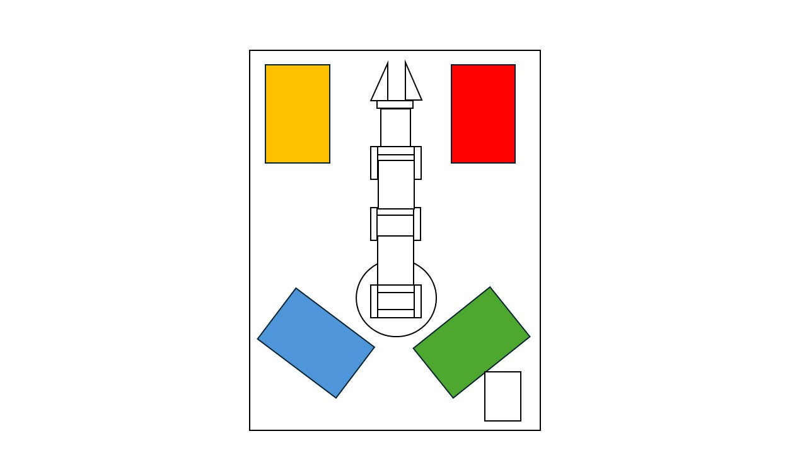

# Proyecto de Robótica

# Integrantes

**Juan Ángel Vargas Rodríguez**
juvargasro@unal.edu.co

**Santiago Mariño Cortés**
smarinoc@unal.edu.co

**Juan José Delgado Estrada**
judelgadoe@unal.edu.co

**Samuel David Sánchez Cárdenas**
samsanchezca@unal.edu.co

**Santiago Ávila Corredor**
savilaco@unal.edu.co

## 1. Rutinas de las figuras

Rutina que recoja cubo, cilindro, pentágono y rectángulo y los deposite en su caneca correspondiente (roja/verde/azul/amarilla).

## 2. Nodos

## 3. Agregar canastilla y soporte/mástil de cámara en Xacro (visual + colisiones)

La canastilla y el soporte/mástil se encuentran añadidos en [canastilla.stl](phantom_ws/src/phantomx_pincher_description/meshes/STL/canastilla.stl) y el soporte está en [ensambleSoporteCamara.stl](phantom_ws/src/phantomx_pincher_description/meshes/STL/ensambleSoporteCamara.stl)

## 4. Simulación de la rutina

Video tipo presentación con duración entre 7 a 10 minutos, deberá incluir el clip de introducción de
LabSIR, seguido de un banner de la Universidad Nacional de Colombia, autores, profesores, curso, año,
etc. 

## 5. Implementación de la rutina

Video tipo presentación con duración entre 7 a 10 minutos, deberá incluir el clip de introducción de
LabSIR, seguido de un banner de la Universidad Nacional de Colombia, autores, profesores, curso, año,
etc. 

## 6. Detectar las 4 figuras	Detección funcional para cubo/cilindro/pentágono/rectángulo (demostrable).

## 7.Paquetes creados

Lista de paquetes creados, propósito, nodos principales y cómo ejecutarlos.Lista de paquetes creados, propósito, nodos principales y cómo ejecutarlos.

## 8. Lógica del código de detección

### Librerías

Las librerías usadas son las siguientes:

```
import cv2
import numpy as np
import math
```
La librería cv2 se usa para la visión artificial o de máquina, en este caso va a ser útil para la segmentación de objetos, detección de contornos, formas y vértices, la aproximación de polígonos Aproximar polígonos, analizar convexidad de los objetos y demás funcionalidades con el reconocimiento de las formas de acuerdo a su geometría, rotación y escala.

numpy se usa para el manejo de arreglos y matrices, adicionalmente se usa en funciones matemáticas y estadísticas. math se integra para el uso de funciones matemáticas y geométricas, es usado en los cálculos de las coordenadas polares.

```

def calcular_caracteristicas_geometricas(cnt):
    """
    Calcula múltiples características geométricas invariantes a rotación.
    Estas son más robustas que solo contar vértices.
    """
    area = cv2.contourArea(cnt)
    perimetro = cv2.arcLength(cnt, True)

    if area < 100 or perimetro < 10:
        return None

    circularidad = (4 * math.pi * area) / (perimetro * perimetro)

    hull = cv2.convexHull(cnt)
    area_hull = cv2.contourArea(hull)
    solidez = area / area_hull if area_hull > 0 else 0

    x, y, w, h = cv2.boundingRect(cnt)
    area_rect = w * h
    extension = area / area_rect if area_rect > 0 else 0
    aspect_ratio = w / h if h > 0 else 0

    if len(cnt) >= 5:
        ellipse = cv2.fitEllipse(cnt)
        (cx_e, cy_e), (eje_menor, eje_mayor), angle = ellipse
        elipse_ratio = eje_menor / eje_mayor if eje_mayor > 0 else 0
    else:
        elipse_ratio = aspect_ratio

    vertices_list = []
    for eps_factor in [0.01, 0.02, 0.03, 0.04]:
        approx = cv2.approxPolyDP(cnt, eps_factor * perimetro, True)
        vertices_list.append(len(approx))
    n_vertices = int(np.median(vertices_list))

    hull_indices = cv2.convexHull(cnt, returnPoints=False)
    if len(hull_indices) > 3:
        defects = cv2.convexityDefects(cnt, hull_indices)
        n_defectos = len(defects) if defects is not None else 0
    else:
        n_defectos = 0

    momentos = cv2.moments(cnt)
    hu_moments = cv2.HuMoments(momentos).flatten()
    hu_log = -np.sign(hu_moments) * np.log10(np.abs(hu_moments) + 1e-10)

    return {
        "area": area,
        "perimetro": perimetro,
        "circularidad": circularidad,
        "solidez": solidez,
        "extension": extension,
        "aspect_ratio": aspect_ratio,
        "elipse_ratio": elipse_ratio,
        "n_vertices": n_vertices,
        "vertices_list": vertices_list,
        "n_defectos": n_defectos,
        "hu_moments": hu_log,
        "contorno": cnt,
    }

```
La función ``` calcular_caracteristicas_geometricas(cnt) ``` tiene un atributo ``` cnt ``` que se refiere a un contorno, en la función se realiza el cálculo del área y el perimetro y con ellas se filtra el ruido de acuerdo a las dimensiones de los objetos con los que se va a trabajar- La variable ``` circularidad ``` se usa para determinar si el objeto es un esférico o si por el contrario es un polígono.

Las funciones ```  hull = cv2.convexHull(cnt) ``` ``` area_hull = cv2.contourArea(hull) ``` son implementadas para el cálculo del contorno del casco y el área de este para un determinado objeto. Otra validación realizada es la de la solidez, que determina si una figura es concava o convexa. También es necesario definir un rectángulo que encierre los contornos y esto se hace mediante  ```  x, y, w, h = cv2.boundingRect(cnt) ``` y se define el área con los parámetros ``` w ``` y ``` h ``` y con el área se realiza el cálculo de la extensión y se puede establecer una relación ancho-alto en la que se puede determinar si la forma es un cuadrado.

Posteriormente se ajusta una elipse con 5 puntos al contorno ``` ellipse = cv2.fitEllipse(cnt) ``` y se extrae el ángulo, los ejes y el centro con ``` (cx_e, cy_e), (eje_menor, eje_mayor), angle = ellipse ``` y similar a como se hacía en el cuadrado se establece una relación pero ahora entre ejes y así poder determinar si se tiene una elipse o un círculo. Si no se logra el ajuste de la elipse al contorno se usa ``` elipse_ratio = aspect_ratio ``` . Los vértices de la elipse se guardan en una lista y se realiza una aproximación de robustez con un ciclo for y se procede a realizar la aproximación a un polígono con ```  approx = cv2.approxPolyDP(cnt, eps_factor * perimetro, True) ``` y se guarda la cantidad de vertices en la lista previamente creada. Posteriormente se usa el filtrado de datos y ruido usando la mediana.

Después se encuentra la sección de los defectos convexos y se inicia obteniendo los índices del casco convexos ```  hull_indices = cv2.convexHull(cnt, returnPoints=False) ``` y posteriormente la detección de defectos con ``` defects = cv2.convexityDefects(cnt, hull_indices) ``` cuando se tiene un número de índices mayor a tres.

Para el cálculo de momentos se usa 
```
momentos = cv2.moments(cnt)
hu_moments = cv2.HuMoments(momentos).flatten()
hu_log = -np.sign(hu_moments) * np.log10(np.abs(hu_moments) + 1e-10)

```
Donde ``` hu_moments = cv2.HuMoments(momentos).flatten() ``` hacen referencia a momentos invariantes con respecto a rotaciones y a diferentes escalas.

Después de realizar los procedimientos anteriores se procede a la clasificación de la forma mediante la función ``` def clasificar_forma(features, area_cm2=None) ``` que se basa en un sistema con puntajes respecto a las variables anteriores de circularidad, solidez, el aspect ratiom, elipse y números de vértices. Se suman los puntajes obtenidos y mediante el diccionario ``` scores ``` se guardan los puntajes, para así clasificar la figura como un circulo, cuadrado, rectángulo o pentágono, de acuerdo a dicho puntaje obtenido.

La función ``` detectar_figuras_y_polares(frame, debug=False) ``` comienza usando una escala de grises con lo objetos y seguidamente realiza una segmentación por color, define el centro de la imagen y delimita una región de interés para posteriormente segmentar un disco blanco y tomar el contorno más grande del disco, a este le encuentra el centro y radio en pixeles y realiza la conversión a una unidad de medida que en nuestro caso es cm. 

Posteriormente procede a segmentar las piezas naranjas dentro del disco y obtiene el area en cm^2, la distancia al centro y define un ángulo polar entre 0° y 360°. Después de realizar cálculos adicionales se procede a asignar un nombre a la forma, un nivel de confianza, un radio en cm, un ángulo, la distancia al centro en x y y, y un atributo de features; al terminar la asignación se guardan los valores obtenidos en un vector llamado resultados.

En la parte final se tienen las utilidaes pedidas en dónde se tienen diferentes funciones. La primera es ``` def shape_name_to_code(shape_name: str) -> str ``` que codifica las formas ya clasificadas asignándoles una letra a cada una. Adicionalmente está la función ``` def polar_to_cartesian_m(r_cm: float, theta_deg: float, offset_x_m: float = 0.0, offset_y_m: float = 0.0) ``` que realiza el cambio de coordenadas polares a cartesianas mediante los parámetros previamente obtenidos. Finalmente se tiene la función ``` def pick_best_detection(info: dict) ``` que recibe un diccionario con las detecciones de la cámara y selecciona la que mayor confianza tenga y hace una lista con las figuras detectadas y que se hallan clasificado retorna la mejor.

## 9. Imágenes o video de la detección

## 10. Funcionamiento

La cámara que se usó para el laboratorio fue una cámara web HD C270 de la marca logitech de 720p y 30 FPS, tiene un campo visual de 55°, un micrófono con un alcance de 1.5 m, corrección de iluminación automática  y funciona en dispositivos con windows 8 o posteriores, macOS 10.10 o posteriores o chromeOS, se conecta mediante un Puerto USB-A de la Raspberry pi que se usa . La configuración de cámara se realiza en el código de [OpenCV.py](phantom_ws/src/pincher_control/pincher_control/OpenCV.py) y principalmente mediante el uso de ``` cv2 ```

Primero se incializa la cámara con ``` cap = cv2.VideoCapture(0) ```` y se le asigna a la cámara que vamos a usar el índice 0.

```
cap.set(cv2.CAP_PROP_FOURCC, cv2.VideoWriter_fourcc(*"MJPG"))
cap.set(cv2.CAP_PROP_FRAME_WIDTH, 640)
cap.set(cv2.CAP_PROP_FRAME_HEIGHT, 480)
cap.set(cv2.CAP_PROP_FPS, 30)
```
En estas líneas de código se realiza la configuración de la resolución que se va a trabajar, en este caso se usa una resolución de 640x480 con 30 FPS.
<p align="center">
  
</p>

Qué cámara usaron, cómo la conectaron/configuraron, problemas y solución (drivers/paquetes adicionales si aplicó).

## 11. Nodos y comunicación

Diagrama tipo rqt_graph o equivalente, explicando tópicos/servicios/acciones y flujo de datos.

## 12. Repositorio

Repositorio que incluya el workspace completo con todos los paquetes y scripts usadosRepositorio que incluya el workspace completo con todos los paquetes y scripts usados

## 13. Plano de planta

<p align="center">
  
</p>

## 14. Diagrama de flujo

Diagrama de flujo escrito en Mermaid (idealmente embebido en el README o en un .md) mostrando la lógica general del sistema.
