<div align="center">


<br/>

<!-- Title -->


<br/>

<!-- Badges -->


<br/><br/>

**Sistema completo de manipulación robótica con detección de figuras geométricas y arquitectura distribuida ROS 2**

[📹 Ver Demo](#-videos-demostrativos) · [🚀 Instalación](#-instalación-y-configuración) · [📖 Documentación](#-tabla-de-contenidos) · [👥 Equipo](#-autores)
</div>

---

## 📖 Resumen Ejecutivo

Sistema robótico avanzado de **Pick & Place** con visión artificial para el robot **PhantomX Pincher X100**. Implementa una arquitectura distribuida de nodos ROS 2 donde:

- **`opencv_detector`** (Publisher Node) — Captura video, detecta figuras geométricas y publica coordenadas 3D
- **`pincher_controller`** (Subscriber Node) — Controla el robot, ejecuta pick & place y proporciona interfaz gráfica

El sistema detecta y clasifica automáticamente figuras geométricas (círculo, cuadrado, rectángulo, pentágono) de color naranja sobre un disco blanco de referencia, calcula sus coordenadas polares y cartesianas, y ejecuta rutinas autónomas de recolección y clasificación.

### ✨ Características Principales

- ✅ **Arquitectura Distribuida ROS 2** — Nodos independientes con comunicación por tópicos
- ✅ **Detección Automática** — 4 tipos de figuras geométricas con scoring multicriterio
- ✅ **Coordenadas Polares** — Cálculo en tiempo real respecto al disco de referencia
- ✅ **Cinemática Inversa** — Algoritmo Levenberg-Marquardt con múltiples semillas
- ✅ **GUI Profesional** — Interfaz moderna con PyQt5 y 8 pestañas de control
- ✅ **Visualización Avanzada** — Integración con RViz2 y Robotics Toolbox
- ✅ **Hardware & Software** — Compatible con robot real y visualización simulada

<div align="center">

</div>

---

## 🎥 Videos Demostrativos

<div align="center">

| Video | Descripción | Enlace |
|:-----:|:------------|:------:|
| 🎬 **Demo Final** | Sistema completo con OpenCV y Pick & Place | [](https://youtu.be/jv4XF2xeA04) |
| 🔧 **Demo Preliminar** | Funcionamiento básico sin visión artificial | [](https://youtu.be/obf1X0HfMZE) |

</div>

---

## 👥 Autores

<div align="center">

| Autor | Correo | GitHub |
|:------|:-------|:-------|
| **Samuel David Sanchez Cardenas** | samsanchezca@unal.edu.co | [](https://github.com/samsanchezcar) |
| **Santiago Ávila Corredor** | savilaco@unal.edu.co | [](https://github.com/Santiago-Avila) |
| **Santiago Mariño Cortés** | smarinoc@unal.edu.co | [](https://github.com/mrbrightside8) |
| **Juan Ángel Vargas Rodríguez** | juvargasro@unal.edu.co | [](https://github.com/juvargasro) |
| **Juan José Delgado Estrada** | judelgadoe@unal.edu.co | [](https://github.com/Juan-delgado1) |

**Universidad Nacional de Colombia · Facultad de Ingeniería Mecatrónica · Robótica · Semestre 2025-1**

</div>

<div align="center">

</div>

---

## 📋 Tabla de Contenidos

1. [Introducción](#-introducción)
2. [Objetivos](#-objetivos)
3. [Arquitectura del Sistema](#-arquitectura-del-sistema)
4. [Instalación y Configuración](#-instalación-y-configuración)
5. [Estructura de Paquetes](#-estructura-de-paquetes)
6. [Sistema de Visión OpenCV](#-sistema-de-visión-opencv)
7. [Controlador Principal](#-controlador-principal)
8. [Interfaz Gráfica (GUI)](#-interfaz-gráfica-gui)
9. [Nodos y Tópicos ROS 2](#-nodos-y-tópicos-ros-2)
10. [Configuración de Cámara](#-configuración-de-cámara)
11. [Calibración del Sistema](#-calibración-del-sistema)
12. [Ejecución del Sistema](#-ejecución-del-sistema)
13. [Troubleshooting](#-troubleshooting)
14. [Cinemática del Robot](#-cinemática-del-robot)
15. [Plano de Planta](#-plano-de-planta)
16. [Conclusiones](#-conclusiones)
17. [Referencias](#-referencias)

---

## 📖 Introducción

Este proyecto representa la culminación del curso de Robótica, integrando múltiples disciplinas: cinemática de manipuladores, visión por computadora, control de actuadores y desarrollo de software robótico. El sistema permite al robot **PhantomX Pincher X100** identificar, localizar y manipular objetos geométricos de manera autónoma.

---

## 🎯 Objetivos

### Objetivo General

Desarrollar un sistema robótico completo de **Pick & Place** con visión artificial que permita al robot PhantomX Pincher X100 detectar, clasificar y manipular figuras geométricas de manera autónoma utilizando una arquitectura distribuida de nodos ROS 2.

### Objetivos Específicos

1. **Implementar arquitectura distribuida ROS 2** con nodos independientes para visión y control
2. **Desarrollar sistema de detección** con OpenCV capaz de identificar círculos, cuadrados, rectángulos y pentágonos
3. **Calcular coordenadas polares** de objetos respecto a disco de referencia
4. **Implementar cinemática inversa robusta** con algoritmo Levenberg-Marquardt
5. **Crear interfaz gráfica profesional** con PyQt5 para operación intuitiva
6. **Desarrollar rutinas automatizadas** de Pick & Place con clasificación por forma
7. **Integrar con MoveIt2** para planificación de trayectorias
8. **Documentar completamente** el sistema para replicabilidad

<div align="center">

</div>

---

## 🏗️ Arquitectura del Sistema

### Diagrama General de Componentes

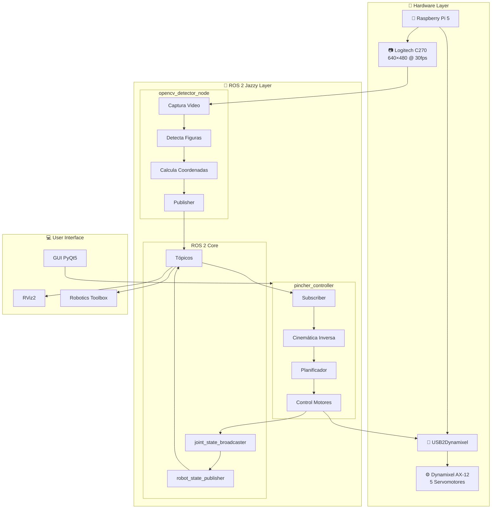
```mermaid
flowchart TB
    subgraph HARDWARE["🔧 Hardware Layer"]
        CAM[📷 Logitech C270<br/>640×480 @ 30fps]
        MOTORS[⚙️ Dynamixel AX-12<br/>5 Servomotores]
        USB[🔌 USB2Dynamixel]
        RPI[🍇 Raspberry Pi 5]
    end
    
    subgraph ROS2["🤖 ROS 2 Jazzy Layer"]
        direction TB
        subgraph VISION_NODE["opencv_detector_node"]
            CAPTURE[Captura Video]
            DETECT[Detecta Figuras]
            COORDS[Calcula Coordenadas]
            PUB[Publisher]
        end
        subgraph CONTROL_NODE["pincher_controller"]
            SUB[Subscriber]
            IK[Cinemática Inversa]
            TRAJ[Planificador]
            MOTOR_CTRL[Control Motores]
        end
        subgraph ROS_CORE["ROS 2 Core"]
            TOPICS[Tópicos]
            RSP[robot_state_publisher]
            JSB[joint_state_broadcaster]
        end
    end
    
    subgraph GUI_LAYER["💻 User Interface"]
        GUI[GUI PyQt5]
        RVIZ[RViz2]
        TOOLBOX[Robotics Toolbox]
    end
    
    CAM --> CAPTURE
    USB --> MOTORS
    RPI --> CAM
    RPI --> USB
    CAPTURE --> DETECT --> COORDS --> PUB
    PUB --> TOPICS --> SUB
    SUB --> IK --> TRAJ --> MOTOR_CTRL --> USB
    MOTOR_CTRL --> JSB --> RSP --> TOPICS
    GUI --> CONTROL_NODE
    TOPICS --> RVIZ
    TOPICS --> TOOLBOX
```

### Diagrama de Nodos ROS 2

```
┌─────────────────────────┐
│   opencv_detector_node  │
│      (Publisher)        │
└───────────┬─────────────┘
            │  /opencv/image
            │  /opencv/shape
            │  /opencv/target_point
            │  /opencv/target_joint
            │  /opencv/detection_info
            ▼
     ┌──────────────┐
     │ Tópicos ROS 2│
     └──────┬───────┘
            │
            ▼
┌─────────────────────────┐
│   pincher_controller    │
│  (Subscriber + GUI)     │
└───────────┬─────────────┘
            │  /joint_states
            ▼
     ┌──────────────────┐
     │ robot_state_pub  │
     │      RViz2       │
     └──────────────────┘
```

<div align="center">
  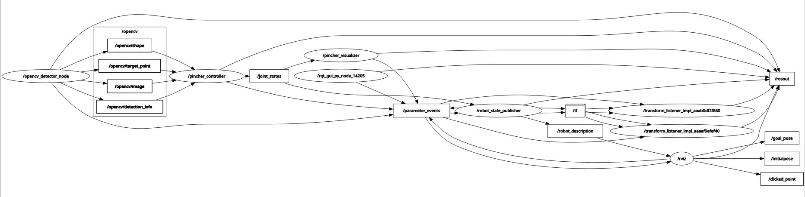
  <p><em>Grafo real del sistema capturado con rqt_graph</em></p>
</div>

<div align="center">

</div>

---

## 📥 Instalación y Configuración

### Requisitos del Sistema

| Componente | Versión |
|:-----------|:--------|
| Sistema Operativo | Ubuntu 24.04 LTS |
| ROS 2 | Jazzy Jalisco |
| Python | 3.12+ |
| OpenCV | 4.x |
| PyQt5 | 5.15+ |
| MoveIt2 | Jazzy |

### Paso 1: Dependencias ROS 2

```bash
sudo apt update && sudo apt upgrade -y
sudo apt install -y ros-jazzy-desktop-full \
    ros-jazzy-moveit \
    ros-jazzy-ros2-control \
    ros-jazzy-ros2-controllers \
    ros-jazzy-dynamixel-sdk \
    ros-jazzy-cv-bridge \
    ros-jazzy-rqt \
    ros-jazzy-rviz2
```

### Paso 2: Dependencias Python

```bash
pip3 install opencv-python numpy PyQt5 PyQt5-sip \
             roboticstoolbox-python spatialmath-python \
             dynamixel-sdk scipy matplotlib
```

### Paso 3: Clonar y Compilar

```bash
mkdir -p ~/ros2_ws/phantom_ws/src
cd ~/ros2_ws/phantom_ws/src
git clone https://github.com/samsanchezcar/Phantom_X_Pincher_ROS2_OpenCV.git .
cd ~/ros2_ws/phantom_ws
colcon build
source install/setup.bash
```

<div align="center">

</div>

---

## 📁 Estructura de Paquetes

```
Phantom_X_Pincher_ROS2_OpenCV/
├── README.md
├── sources/                               # 📸 Recursos multimedia
│   ├── DH.png
│   ├── camara.png
│   ├── plano_inicial.jpg
│   ├── plano_final.jpg
│   └── gui/
│
├── phantomx_pincher_description/          # 📐 URDF/XACRO
│   ├── urdf/
│   ├── meshes/
│   └── launch/
│
├── phantomx_pincher_moveit_config/        # 🎯 MoveIt2
│   ├── config/
│   └── launch/
│
├── pincher_control/                       # 🎮 Control + GUI
│   └── pincher_control/
│       ├── control_servo2.py             # ⭐ Controlador principal
│       ├── opencv_detector.py            # ⭐ Detector OpenCV
│       └── toolbox_viz.py
│
└── phantomx_pincher_bringup/              # 🚀 Launch principal
    └── launch/
```

| Archivo | Descripción |
|:--------|:------------|
| `control_servo2.py` | Nodo subscriber, controlador principal con GUI |
| `opencv_detector.py` | Nodo publisher, detección de figuras |
| `pincher_opencv.launch.py` | Launch file para ambos nodos |

<div align="center">

</div>

---

## 👁️ Sistema de Visión OpenCV

### Pipeline de Detección

<div align="center">
  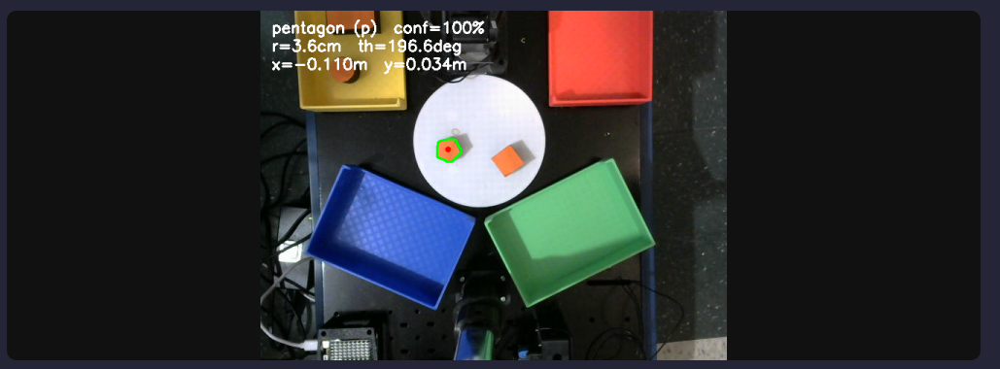
  <p><em>Sistema de detección con OpenCV — overlays en tiempo real</em></p>
</div>

#### 1 · Inicialización del Nodo Publisher

```python
class OpenCVDetectorNode(Node):
    def __init__(self):
        super().__init__('opencv_detector_node')
        self.declare_parameter('camera_index', 0)
        self.declare_parameter('publish_rate', 10.0)
        
        self.cap = cv2.VideoCapture(self.get_parameter('camera_index').value)
        self.cap.set(cv2.CAP_PROP_FRAME_WIDTH, 640)
        self.cap.set(cv2.CAP_PROP_FRAME_HEIGHT, 480)
        self.cap.set(cv2.CAP_PROP_FOURCC, cv2.VideoWriter_fourcc(*"MJPG"))
        
        # Publishers
        self.image_pub        = self.create_publisher(Image,        '/opencv/image',          10)
        self.shape_pub        = self.create_publisher(String,       '/opencv/shape',          10)
        self.target_point_pub = self.create_publisher(PointStamped, '/opencv/target_point',   10)
        self.detection_info_pub = self.create_publisher(String,     '/opencv/detection_info', 10)
        
        self.timer = self.create_timer(1.0 / self.get_parameter('publish_rate').value, self.process_frame)
```

#### 2 · Clasificación Multicriterio

```python
def classify_shape(contour):
    """Scoring multicriterio: vértices + circularidad + aspect ratio + solidez"""
    epsilon  = 0.04 * cv2.arcLength(contour, True)
    approx   = cv2.approxPolyDP(contour, epsilon, True)
    vertices = len(approx)
    
    area        = cv2.contourArea(contour)
    perimeter   = cv2.arcLength(contour, True)
    circularity = (4 * np.pi * area) / (perimeter ** 2) if perimeter > 0 else 0
    rect        = cv2.minAreaRect(contour)
    w, h        = rect[1]
    aspect_ratio = max(w, h) / min(w, h) if min(w, h) > 0 else 0
    
    scores = {'circle': 0, 'square': 0, 'rectangle': 0, 'pentagon': 0}
    
    if vertices == 5:             scores['pentagon']   += 3.0
    elif vertices == 4:
        if 0.85 < aspect_ratio < 1.15: scores['square'] += 2.5
        else:                          scores['rectangle'] += 2.5
    elif vertices > 8:            scores['circle']     += 3.0
    
    if circularity > 0.85:        scores['circle']     += 2.0
    elif 0.7 < circularity < 0.85: scores['pentagon']  += 1.5
    
    best  = max(scores, key=scores.get)
    conf  = min(scores[best] / 6.0, 1.0)
    codes = {'circle': 'c', 'square': 's', 'rectangle': 'r', 'pentagon': 'p'}
    return codes[best], best, conf
```

#### 3 · Coordenadas Polares → Cartesianas 3D

```python
def calculate_polar_coords(shape_center, disk_center, disk_radius_px):
    DISK_RADIUS_CM = 7.25
    scale    = DISK_RADIUS_CM / disk_radius_px
    dx, dy   = shape_center[0] - disk_center[0], shape_center[1] - disk_center[1]
    r_cm     = np.sqrt(dx**2 + dy**2) * scale
    theta_deg = np.degrees(np.arctan2(-dy, dx)) % 360
    return r_cm, theta_deg

def polar_to_cartesian_3d(r_cm, theta_deg):
    OPENCV_OFFSET_X_M, OPENCV_OFFSET_Y_M = -0.1, 0.0
    r_m   = r_cm / 100.0
    theta = np.radians(theta_deg)
    return r_m * np.cos(theta) + OPENCV_OFFSET_X_M, \
           r_m * np.sin(theta) + OPENCV_OFFSET_Y_M, \
           -0.025
```

### Detección por Forma

<div align="center">
<table>
<tr>
<td align="center">
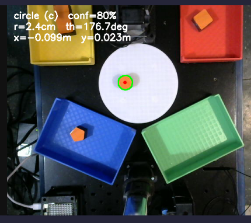<br/>
<b>🔵 Círculo</b><br/>
0.88-0d0d1a?style=flat-square&logoColor=67e8f9"/>
</td>
<td align="center">
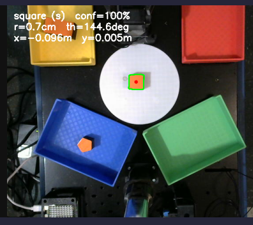<br/>
<b>🟥 Cuadrado</b><br/>

</td>
<td align="center">
<br/>
<b>🟩 Rectángulo</b><br/>

</td>
<td align="center">
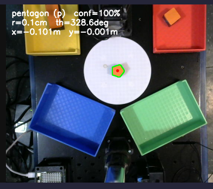<br/>
<b>🟡 Pentágono</b><br/>

</td>
</tr>
</table>
</div>

<div align="center">

</div>

---

## 🎮 Controlador Principal

### Cinemática Inversa — Levenberg-Marquardt

```python
def inverse_kinematics_lm(target_pos, initial_guess=None, max_iterations=100):
    lambda_param, tolerance = 0.01, 1e-4
    q = np.array(initial_guess or [0.0, 0.0, 0.0, 0.0])
    prev_error_norm = float('inf')
    
    for _ in range(max_iterations):
        T            = forward_kinematics(q)
        error        = target_pos - T[0:3, 3]
        error_norm   = np.linalg.norm(error)
        
        if error_norm < tolerance:
            return q, True
        
        J_pos        = geometric_jacobian(q)[0:3, :]
        JtJ          = J_pos.T @ J_pos
        delta_q      = np.linalg.inv(JtJ + lambda_param * np.eye(4)) @ J_pos.T @ error
        q            = np.clip(q + delta_q, JOINT_LIMITS_MIN, JOINT_LIMITS_MAX)
        lambda_param *= 0.9 if error_norm < prev_error_norm else 1.5
        prev_error_norm = error_norm
    
    return q, False
```

### Rutina Pick & Place — 8 pasos

```python
def execute_pick_and_place(self, detection):
    pick_pos     = np.array([detection['x_m'], detection['y_m'], detection['z_m']])
    approach_pos = pick_pos + np.array([0, 0, 0.05])   # +5cm sobre objeto
    drop_pos     = np.array(DROP_POINTS[detection['shape_code']])
    drop_approach = drop_pos + np.array([0, 0, 0.05])
    
    steps = [
        (self.move_to_home_opencv,                   "1/8 Home"),
        (lambda: self.set_gripper_position(OPEN),    "2/8 Open gripper"),
        (lambda: self.move_to_xyz(approach_pos),     "3/8 Approach"),
        (lambda: self.move_to_xyz(pick_pos),         "4/8 Descend"),
        (lambda: self.set_gripper_position(CLOSED),  "5/8 Grasp"),
        (lambda: self.move_to_xyz(approach_pos),     "6/8 Lift"),
        (lambda: self.move_to_xyz(drop_approach),    "7/8 Transport"),
        (lambda: self.move_to_xyz(drop_pos),         "8/8 Drop"),
    ]
    for step_fn, label in steps:
        self.get_logger().info(label)
        step_fn(); time.sleep(0.5)
    
    self.set_gripper_position(OPEN)
    self.move_to_home_opencv()
```

**Contenedores por forma:**

| Forma | Color | Posición (x, y, z) m |
|:-----:|:-----:|:--------------------:|
| Cuadrado | 🔴 Rojo | (0.15, −0.15, −0.02) |
| Rectángulo | 🟢 Verde | (0.15, 0.15, −0.02) |
| Círculo | 🔵 Azul | (0.20, 0.0, −0.02) |
| Pentágono | 🟡 Amarillo | (0.12, 0.0, −0.02) |

<div align="center">

</div>

---

## 💻 Interfaz Gráfica (GUI)

### 7 Pestañas de Control

| Pestaña | Función | Imagen |
|:-------:|:--------|:------:|
| **Dashboard** | Estado general, posición XYZ | 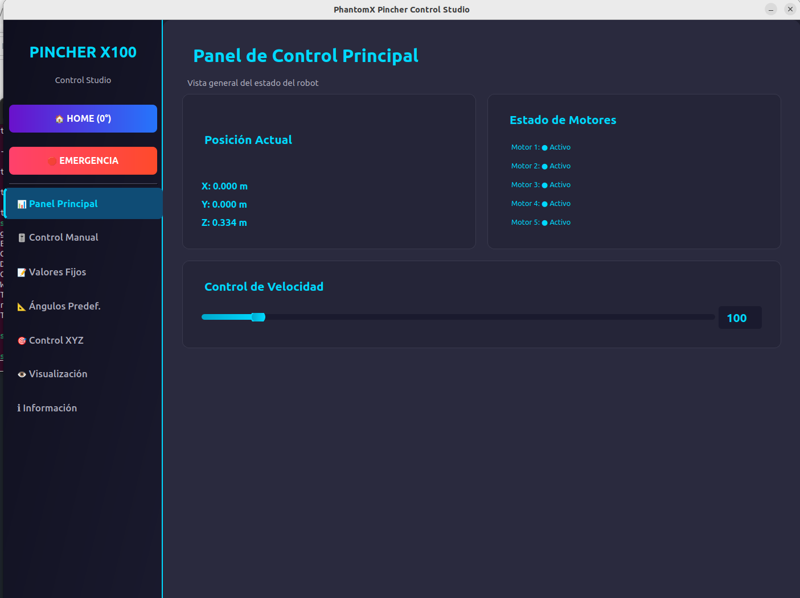 |
| **Manual Control** | Sliders por motor | 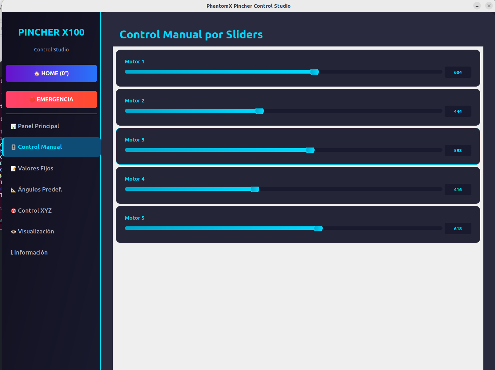 |
| **Fixed Values** | Entrada numérica precisa | 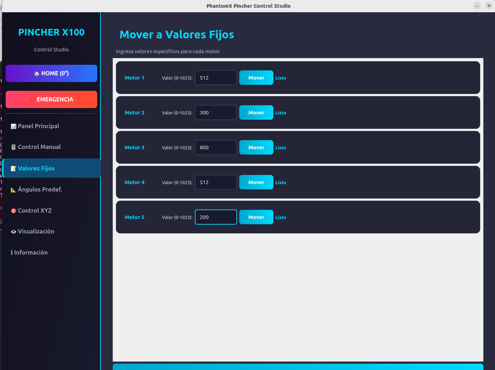 |
| **Fixed Angles** | 5 poses predefinidas | 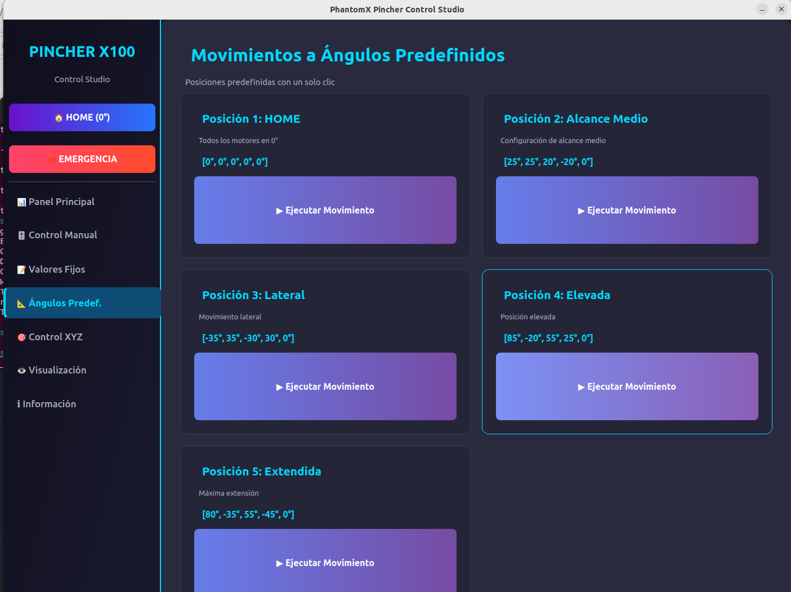 |
| **XYZ Control** | Control cartesiano con IK | 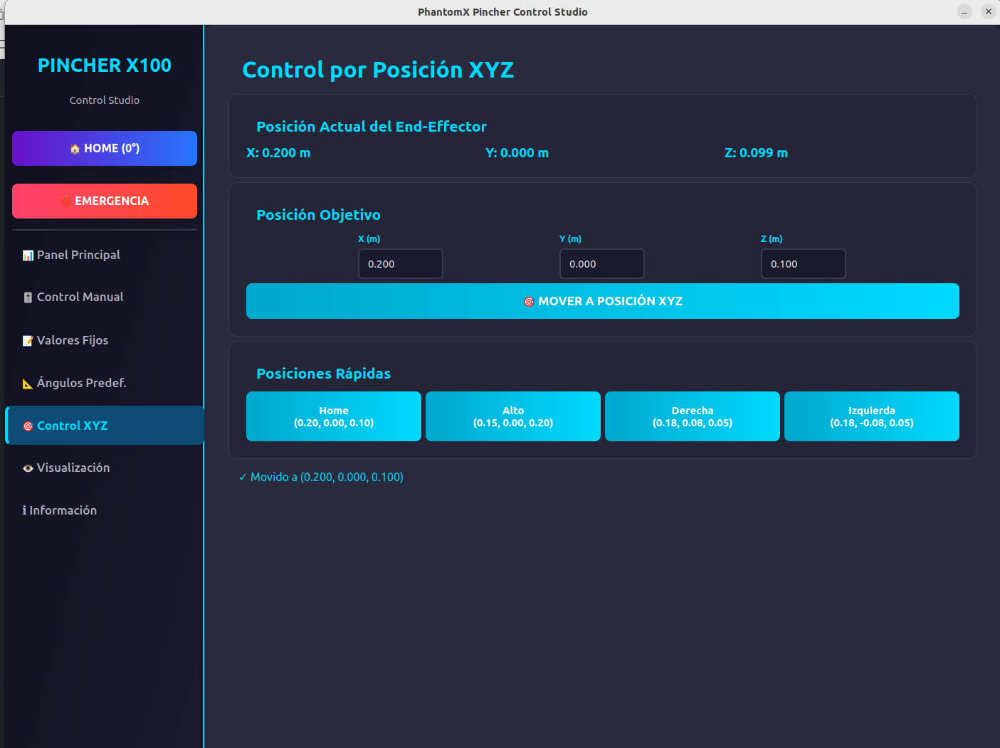 |
| **OpenCV** | Vista de cámara + Pick & Place | 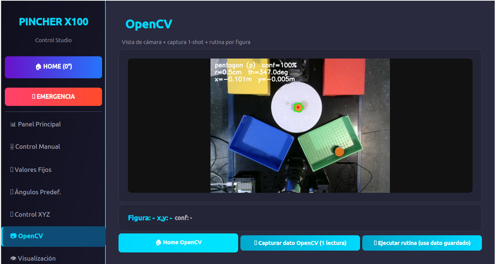 |
| **Visualization** | RViz2 + Robotics Toolbox | 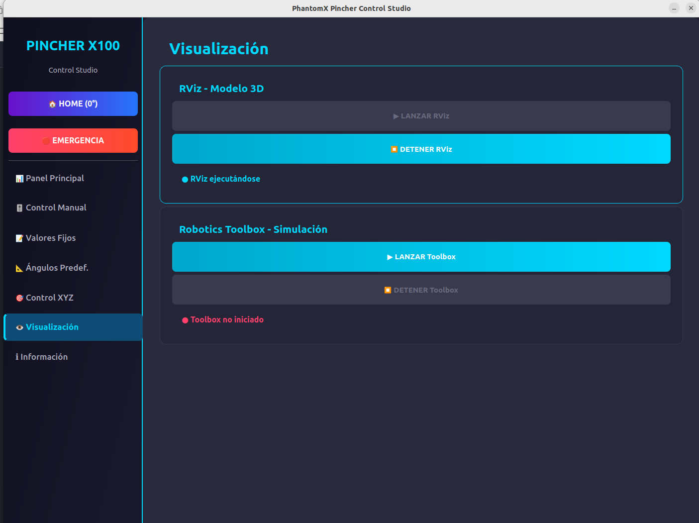 |

<div align="center">

</div>

---

## 🔄 Nodos y Tópicos ROS 2

### Tópicos publicados por `opencv_detector_node`

| Tópico | Tipo | Hz | Descripción |
|:-------|:-----|:--:|:------------|
| `/opencv/image` | `sensor_msgs/Image` | 10 | Imagen procesada 640×480 con overlays |
| `/opencv/shape` | `std_msgs/String` | 10 | Código: `s` `r` `c` `p` `u` |
| `/opencv/target_point` | `geometry_msgs/PointStamped` | 10 | Posición 3D en metros |
| `/opencv/detection_info` | `std_msgs/String` | 10 | JSON completo |

### Formato JSON en `/opencv/detection_info`

```json
{
  "shape_name": "circle",
  "shape_code": "c",
  "confidence": 0.92,
  "r_cm": 5.2,
  "theta_deg": 45.0,
  "x_m": 0.15,
  "y_m": 0.08,
  "z_m": -0.025,
  "timestamp": 1234567890.123
}
```

### Comandos de diagnóstico

```bash
ros2 node list                          # Nodos activos
ros2 topic list | grep opencv           # Tópicos de visión
ros2 topic hz /opencv/image             # Frecuencia (~10 Hz)
ros2 topic echo /opencv/detection_info  # JSON en tiempo real
rqt_graph                               # Grafo visual
ros2 run rqt_image_view rqt_image_view /opencv/image
```

<div align="center">

</div>

---

## 📷 Configuración de Cámara

<div align="center">
  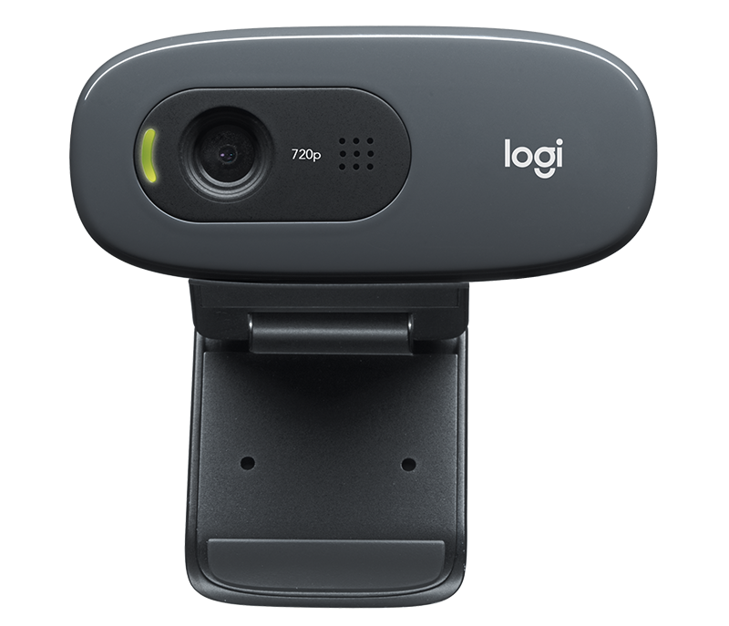
</div>

| Parámetro | Valor |
|:----------|:------|
| Modelo | Logitech HD C270 |
| Resolución de trabajo | 640×480 |
| FPS | 30 |
| Campo visual | 55° diagonal |
| Conexión | USB 2.0 |

**Rangos HSV calibrados:**

```python
lower_orange = np.array([3,  70,  70],  dtype=np.uint8)   # Objetos naranja
upper_orange = np.array([28, 255, 255], dtype=np.uint8)
lower_white  = np.array([0,  0,   200], dtype=np.uint8)   # Disco blanco
upper_white  = np.array([180, 30, 255], dtype=np.uint8)
```

<div align="center">

</div>

---

## ⚙️ Calibración del Sistema

```python
# En opencv_detector.py y control_servo2.py (deben coincidir)
DISK_RADIUS_CM     = 7.25    # Radio físico del disco blanco
OPENCV_OFFSET_X_M  = -0.1   # Offset cámara→robot en X
OPENCV_OFFSET_Y_M  =  0.0   # Offset cámara→robot en Y
Z_OFFSET_M         = -0.025  # Altura de la mesa
```

**Procedimiento de calibración:**
1. Colocar objeto en posición conocida
2. Leer coordenadas detectadas: `ros2 topic echo /opencv/detection_info`
3. Mover robot manualmente a esa posición (pestaña XYZ de la GUI)
4. Calcular `OPENCV_OFFSET = posición_real - posición_detectada`
5. Actualizar en ambos archivos y recompilar

<div align="center">

</div>

---

## 🚀 Ejecución del Sistema

### Launch unificado (recomendado)

```bash
ros2 launch pincher_control pincher_opencv.launch.py

# Con parámetros
ros2 launch pincher_control pincher_opencv.launch.py \
    camera_index:=1 port:=/dev/ttyUSB1 publish_rate:=30.0
```

### Nodos separados

```bash
# Terminal 1
ros2 run pincher_control opencv_detector

# Terminal 2
ros2 run pincher_control control_servo
```

### Flujo de trabajo

1. Iniciar sistema con launch file
2. Verificar tópicos: `ros2 topic list | grep opencv`
3. Colocar figura naranja sobre disco blanco
4. En GUI → pestaña **📷 OpenCV** → esperar detección (indicador verde)
5. Click **📌 Guardar dato actual**
6. Click **🤖 Ejecutar rutina** → confirmar
7. Observar secuencia de pick & place

<div align="center">

</div>

---

## 🐛 Troubleshooting

| Problema | Diagnóstico | Solución |
|:---------|:-----------|:---------|
| Sin imagen en GUI | `ros2 topic hz /opencv/image` | Verificar índice de cámara, permisos `/dev/video0` |
| No detecta figuras | `ros2 run rqt_image_view rqt_image_view /opencv/image` | Ajustar rangos HSV, verificar iluminación |
| Robot en posición incorrecta | `ros2 topic echo /opencv/target_point` | Recalibrar offsets X/Y |
| IK no converge | Revisar logs del nodo | Verificar workspace: `0.05 < r < 0.30m, z > -0.05m` |
| Dynamixel error | `ls -l /dev/ttyUSB*` | `sudo chmod 666 /dev/ttyUSB0` |

```bash
# Debug detallado
ros2 run pincher_control opencv_detector --ros-args --log-level debug
```

<div align="center">

</div>

---

## 📐 Cinemática del Robot

<div align="center">
  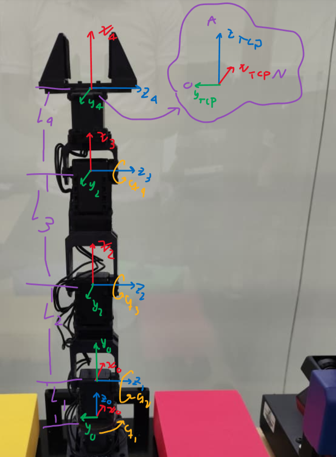
  <p><em>Parámetros Denavit-Hartenberg del PhantomX Pincher X100</em></p>
</div>

### Parámetros DH

| Joint | θ | d (m) | a (m) | α | Límites |
|:-----:|:-:|:-----:|:-----:|:-:|:-------:|
| 1 | q₁ | 0.067 | 0 | π/2 | ±150° |
| 2 | q₂−π/2 | 0 | 0.105 | 0 | ±110° |
| 3 | q₃ | 0 | 0.105 | 0 | ±110° |
| 4 | q₄ | 0 | 0.110 | 0 | ±110° |

**Workspace:** radio 5–30 cm · altura −5 a +25 cm · singularidad en eje Z (x≈0, y≈0)

<div align="center">

</div>

---

## 📐 Plano de Planta

<div align="center">

| Setup inicial | Disposición final |
|:-------------:|:-----------------:|
| 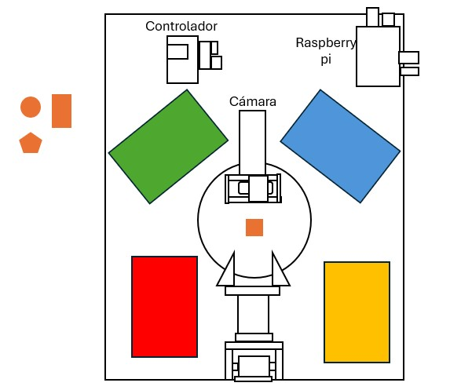 | 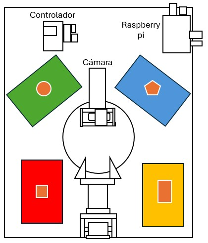 |
| Pieza centrada en disco blanco | Contenedores por forma/color |

</div>

<div align="center">

</div>

---

## 🎓 Conclusiones

**Logros técnicos:** Arquitectura distribuida ROS 2 exitosa · scoring multicriterio >90% precisión · cinemática inversa Levenberg-Marquardt robusta · GUI intuitiva con PyQt5.

**Lecciones aprendidas:** La calibración cámara-robot es crítica · la iluminación afecta directamente las detecciones · la modularidad por nodos acelera el debugging · robustez > velocidad en sistemas de producción.

**Mejoras futuras:** Detección multi-objeto simultáneo · clasificación por color además de forma · planificación con MoveIt2 · evitación de obstáculos dinámica.

---

## 📚 Referencias

1. Laboratorio de Robótica — UNAL. *Guías de laboratorio*, 2025.
2. ROBOTIS. [*DYNAMIXEL SDK Manual*](https://emanual.robotis.com/docs/en/software/dynamixel/dynamixel_sdk/)
3. Open Robotics. [*ROS 2 Jazzy Documentation*](https://docs.ros.org/en/jazzy/)
4. MoveIt. [*MoveIt 2 Documentation*](https://moveit.ros.org/)
5. Corke, P. [*Robotics Toolbox for Python*](https://github.com/petercorke/robotics-toolbox-python)
6. OpenCV. [*OpenCV-Python Tutorials*](https://docs.opencv.org/master/d6/d00/tutorial_py_root.html)
7. Craig, J.J. *Introduction to Robotics: Mechanics and Control.* Pearson, 3rd Ed., 2005.
8. Levenberg, K. *A Method for the Solution of Certain Non-Linear Problems in Least Squares.* 1944.
9. Marquardt, D.W. *An Algorithm for Least-Squares Estimation of Nonlinear Parameters.* 1963.

---

## 🤝 Contribuciones

```bash
git checkout -b feature/AmazingFeature
git commit -m 'Add: AmazingFeature'
git push origin feature/AmazingFeature
# → Abrir Pull Request
```

Estándares: PEP 8 · Conventional Commits · Google Style docstrings

---

<div align="center">
  
</div>
